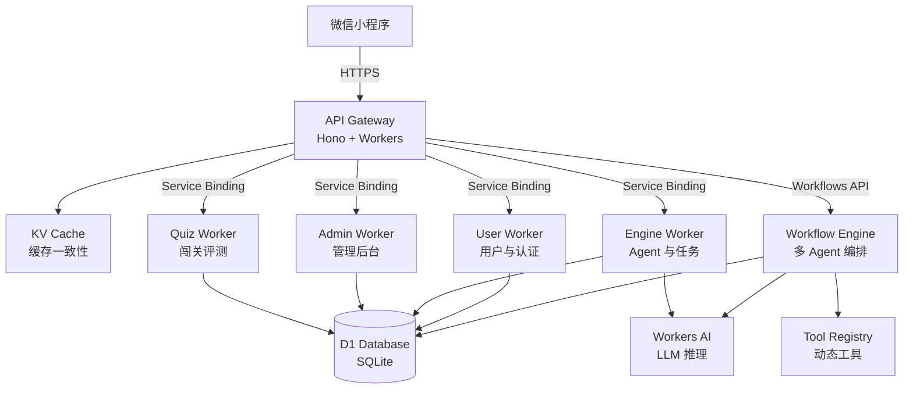

<div align="center">

# Swarm

**企业级智能体编排平台** — 基于 Cloudflare Workers 的多 Agent 协同工作流引擎

[](LICENSE)
[](https://www.typescriptlang.org/)
[](https://workers.cloudflare.com/)
[](https://developers.weixin.qq.com/miniprogram/dev/)
[](https://github.com/jiuxia/swarm/actions/workflows/ci.yml)
[](.github/dependabot.yml)
[](.prettierrc)
[](CONTRIBUTING.md)

</div>

---

## 概述

Swarm 是一个面向微信小程序的企业级智能体（Agent）编排平台。它提供了完整的微服务架构后端，包含 API 网关、多 Agent 工作流引擎、闯关测评系统和管理后台，并通过 Cloudflare Workers 的边缘计算网络实现低延迟交付。

项目采用**契约驱动**的设计理念，严格分离业务逻辑与基础设施，内置全链路可观测性（TraceID 透传 + 结构化日志 + 数据脱敏），适合构建生产级 AI 应用。

---

## 核心特性

- **多智能体编排** — 基于 Cloudflare Workflows 的多 Agent 协同引擎，支持 Supervisor 调度、动态工具注册、记忆上下文管理
- **闯关测评系统** — 阶段式（Stage-based）评测引擎，支持关卡配置、自动评分、经验值/积分奖励
- **统一 API 网关** — JWT 鉴权、RBAC 角色权限、缓存双写失效、全链路 TraceID 透传
- **管理后台** — 用户管理、角色管控、Agent 配置、任务监控、审计日志
- **动态工具注册表** — 插件式工具架构，支持运行时注册与安全沙箱执行
- **微信小程序前端** — 基于 TDesign 组件库的原生小程序，含任务面板、知识图谱、积分系统
- **可观测性** — 结构化日志（TraceLogger）、数据脱敏、全链路追踪、分级日志（DEBUG/INFO/WARN/ERROR）
- **安全设计** — 物理安全隔离（Service Binding + Internal Key）、缓存防穿透防雪崩、脱敏日志

---

## 架构概览



### 分层设计

| 层级 | 组件 | 职责 |
|------|------|------|
| 接入层 | API Gateway | 鉴权、路由、CORS、Service Binding 转发 |
| 业务层 | User / Engine / Admin / Quiz | 各自域的业务逻辑，仅接收内部请求 |
| 编排层 | Workflow Engine | 多 Agent 协同调度、LLM 调用、工具执行 |
| 共享层 | @swarm/shared | 统一 Schema、DTO、常量、日志、缓存工具 |
| 持久层 | D1 Database + KV Cache | SQLite 持久化 + 边缘缓存 |
| 前端层 | 微信小程序 | UI 渲染、状态管理、本地缓存 |

---

## 技术栈

| 领域 | 技术 |
|------|------|
| **运行时** | Cloudflare Workers (边缘计算) |
| **Web 框架** | Hono (轻量 TypeScript 框架) |
| **ORM** | Drizzle ORM (类型安全的 SQLite ORM) |
| **数据库** | Cloudflare D1 (Workers SQLite) |
| **缓存** | Cloudflare KV (边缘键值存储) |
| **AI 推理** | Cloudflare Workers AI (LLaMA 3.1) |
| **工作流** | Cloudflare Workflows (Durable Execution) |
| **前端** | 微信小程序 + TDesign 组件库 |
| **语言** | TypeScript 5.x (strict mode) |
| **构建** | Wrangler CLI, esbuild |

---

## 快速开始

### 前置条件

- Node.js >= 18
- npm / pnpm
- Cloudflare 账号（用于 Workers + D1 + KV + AI）
- 微信小程序 AppID（用于前端开发）
- Wrangler CLI

  ```bash
  npm install -g wrangler
  wrangler login
  ```

### 1. 克隆与安装

```bash
git clone https://github.com/<your-org>/swarm.git
cd swarm

# 安装后端依赖（各 Worker 独立安装）
cd backend/packages/shared && npm install
cd ../../workers/gateway && npm install
cd ../../workers/user && npm install
cd ../../workers/engine && npm install
cd ../../workers/admin && npm install
cd ../../workers/quiz && npm install
cd ../../workers/workflow && npm install

# 安装前端依赖
cd ../../frontend && npm install
```

### 2. 配置环境变量

复制各 Worker 的 `.dev.vars.example` 为 `.dev.vars` 并填入密钥：

```bash
# backend/workers/gateway/.dev.vars
JWT_SECRET=your_jwt_secret
INTERNAL_SECRET=your_internal_secret
ALLOWED_ORIGIN=https://your-domain.com
WX_APP_ID=your_wx_app_id
WX_APP_SECRET=your_wx_app_secret
```

生产环境推荐使用 `init_secrets.sh` 一键注入：

```bash
chmod +x backend/init_secrets.sh
./backend/init_secrets.sh
```

### 3. 数据库初始化

```bash
# 创建 D1 数据库
wrangler d1 create swarm-db

# 执行 schema 迁移
wrangler d1 execute swarm-db --file=backend/schema.sql

# 更新各 Worker 的 wrangler.toml 中数据库 ID
```

### 4. 本地开发

```bash
# 启动网关
cd backend/workers/gateway
npm run dev

# 启动其他 Worker（新终端）
cd backend/workers/user && npm run dev
cd backend/workers/admin && npm run dev

# 前端通过微信开发者工具打开 frontend/ 目录
```

### 5. 部署

```bash
# 部署所有 Worker
cd backend/workers/gateway && npm run deploy
cd backend/workers/user && npm run deploy
cd backend/workers/engine && npm run deploy
cd backend/workers/admin && npm run deploy
cd backend/workers/quiz && npm run deploy
cd backend/workers/workflow && npm run deploy

# 注入生产 Secrets
./backend/init_secrets.sh
```

---

## 项目结构

```
swarm/
├── backend/
│   ├── packages/
│   │   └── shared/              # 共享层（Schema、DTO、常量、日志、缓存）
│   │       ├── src/
│   │       │   ├── schema.ts     # Drizzle 表定义
│   │       │   ├── types.ts      # TypeScript 类型与 DTO
│   │       │   ├── constants.ts  # 业务常量（积分、Token 过期等）
│   │       │   ├── logger.ts     # 结构化日志（TraceLogger）
│   │       │   ├── cache.ts      # 缓存服务（防穿透防雪崩）
│   │       │   └── ...
│   │       └── package.json
│   ├── workers/
│   │   ├── gateway/             # API 网关（鉴权 + 路由 + 服务转发）
│   │   ├── user/                # 用户微服务（微信登录、积分）
│   │   ├── engine/              # 引擎微服务（Agent 管理、任务调度）
│   │   ├── admin/               # 管理后台微服务
│   │   ├── quiz/                # 闯关评测微服务
│   │   └── workflow/            # 工作流引擎（多 Agent 编排）
│   ├── scripts/                 # 工具脚本
│   ├── schema.sql               # 数据库 DDL
│   └── init_secrets.sh          # 生产环境 Secrets 注入
├── frontend/                    # 微信小程序前端
│   ├── pages/                   # 主包页面
│   ├── packageTask/             # 任务分包
│   ├── packageAdmin/            # 管理后台分包
│   ├── packageQuiz/             # 闯关评测分包
│   ├── components/              # 公共组件
│   └── utils/                   # 工具函数
├── docs/
│   └── design_records/          # 架构决策记录（ADR）
├── CODE_OF_CONDUCT.md
├── CONTRIBUTING.md
├── LICENSE
├── SECURITY.md
└── README.md
```

---

## 核心模块说明

### Gateway — API 网关

全局流量入口，负责：
- JWT 鉴权与 Token 版本校验
- RBAC 角色权限控制（FREE_USER / VIP_USER / ADMIN）
- 缓存双写失效（管理端操作后同步废弃 Gateway 缓存）
- 全链路 TraceID 透传与结构化入参/出参日志
- Service Binding 安全转发至内部 Worker

### Workflow — 工作流引擎

基于 Cloudflare Workflows 的多 Agent 编排系统：
- **Supervisor 调度** — 主管 Agent 分解任务并委派给子 Agent
- **动态工具注册表** — 插件式工具架构，工具可通过数据库动态注册
- **记忆管理** — 上下文窗口截断与 Token 预算控制
- **结果汇总** — 自动收集各 Agent 输出并生成结构化摘要

### Quiz — 闯关评测系统

阶段式评测引擎，支持：
- 多关卡（Stage）配置与进度追踪
- 自动评分与通过阈值判定
- 经验值/积分奖励体系
- NPC 对话交互

### Admin — 管理后台

内部管理服务，提供：
- 用户列表查询、角色修改
- Agent 配置管理
- 任务监控与日志查看
- 审计日志记录

### 共享层 (@swarm/shared)

跨 Worker 共享的核心库：
- **Schema** — 统一 Drizzle 表定义，所有 Worker 使用同一份 Schema
- **TraceLogger** — 结构化日志，自动数据脱敏，支持全链路追踪
- **CacheService** — 缓存工具，内置防缓存穿透（Null 占位）和防雪崩（TTL Jitter）
- **DTO** — 请求/响应类型定义，前后端契约对齐

---

## 配置管理

| 变量 | 所属 Worker | 说明 |
|------|-------------|------|
| `JWT_SECRET` | gateway | JWT 签名密钥 |
| `INTERNAL_SECRET` | 全部 | Service Binding 内部认证密钥 |
| `WX_APP_ID` | gateway | 微信小程序 AppID |
| `WX_APP_SECRET` | gateway | 微信小程序 Secret |
| `ALLOWED_ORIGIN` | gateway | CORS 允许的域名 |
| `CACHE_KV` 绑定 | gateway, admin | KV 命名空间绑定 |
| `DB` 绑定 | 全部 | D1 数据库绑定 |
| `AI` 绑定 | workflow, engine | Workers AI 绑定 |

---

## 开发指南

### 代码风格

项目遵循严格的代码规范，详见 [CONTRIBUTING.md](CONTRIBUTING.md)：

- TypeScript strict 模式，禁止 `any`
- 2 空格缩进，LF 换行
- 文件名 kebab-case，函数/变量 camelCase，类型 PascalCase
- 数据库字段 snake_case，Drizzle 映射 camelCase

### 提交规范

```
<type>(<scope>): <subject>

<body>
```

类型：`feat` / `fix` / `refactor` / `style` / `docs` / `chore` / `security`

### 添加新表

1. `backend/packages/shared/src/schema.ts` — 定义 Drizzle 表
2. `backend/packages/shared/src/types.ts` — 定义行类型
3. `backend/schema.sql` — 同步 DDL

---

## 设计决策

项目的架构决策记录（ADR）存放在 `docs/design_records/` 目录下，涵盖：

- [微服务拆分与网关设计模式](docs/design_records/2026-06-16_gateway-design-pattern.md)
- [缓存一致性方案](docs/design_records/2026-06-17_admin-cache-consistency.md)
- [动态工具注册表架构](docs/design_records/2026-06-16_tools-design-pattern.md)
- [企业级重构方案](docs/design_records/2026-06-17_enterprise-refactoring-and-optimization.md)

---

## 贡献指南

感谢你考虑为 Swarm 贡献代码！请阅读：

- [贡献者行为准则](CODE_OF_CONDUCT.md)
- [贡献指南](CONTRIBUTING.md) — 详细的代码规范、提交格式、开发流程

---

## 安全策略

如果你发现了安全漏洞，请查阅 [SECURITY.md](SECURITY.md) 了解报告流程。**请勿在公开 Issue 中提交安全漏洞。**

---

## 许可证

[MIT License](LICENSE) © 2026 Swarm

---

## 致谢

- [Cloudflare Workers](https://workers.cloudflare.com/) — 边缘计算平台
- [Hono](https://hono.dev/) — 轻量级 Web 框架
- [Drizzle ORM](https://orm.drizzle.team/) — TypeScript ORM
- [TDesign](https://tdesign.tencent.com/) — 企业级组件库
- [WeChat Mini Program](https://developers.weixin.qq.com/miniprogram/dev/) — 小程序平台
