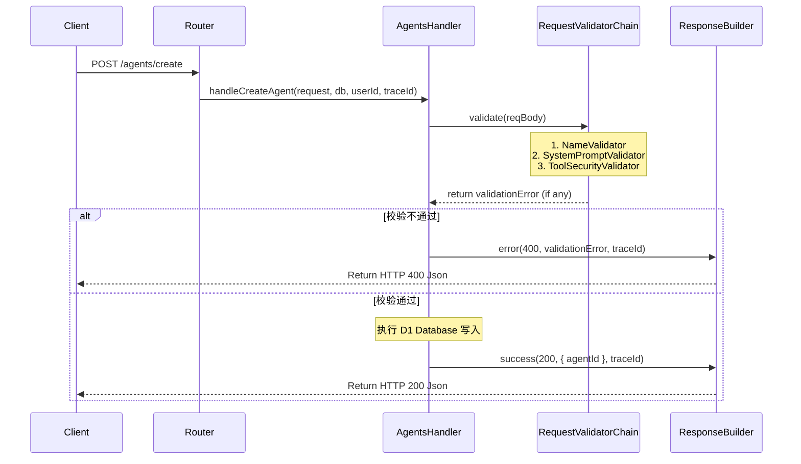

# 架构决策记录 (ADR) - 网关服务层（gateway）大厂规范化及架构设计优化

* 创建日期: 2026-06-16
* 状态: 已批准 (Approved)
* 作者: 首席全栈架构师

---

## 1. 架构定位
- **模块归属**: 后端 API 网关服务层 (`backend/workers/gateway/src`)。
- **主要重构目标**:
  - `gateway/src/handlers/agents.ts` (智能体业务控制器)
  - 提取 `gateway/src/utils/response.ts` [NEW] (统一 HTTP 响应建造者)
  - 提取 `gateway/src/utils/validator.ts` [NEW] (请求参数检验链)
- **解耦设计**:
  - **解耦业务逻辑与传输格式**：由 `ResponseBuilder` 统一托管 JSON 的序列化、MIME 头字段设置、TraceID 透传逻辑，控制器只负责核心业务流程并返回 DTO，不直接操作底层的 `new Response(...)`。
  - **解耦检验规则**：将单个 Handler 中的冗长校验（如空值判定、模型安全白名单、工具安全白名单等）抽象为职责链节点，各规则互不干扰，支持按需装配。
  - **解耦配置与策略**：将支持的 AI 模型以及外部工具的白名单提取为只读常量策略，避免规则漂移。

---

## 2. 核心契约 (TypeScript Interfaces)

```typescript
// 1. 大厂统一接口返回格式
export interface ApiResponse<T = any> {
  success: boolean;
  data?: T;
  error?: string;
  traceId: string;
}

// 2. 统一检验器接口契约
export interface RequestValidator<T = any> {
  validate(data: T): string | null;
}

// 3. 安全策略常量定义
export const SECURITY_POLICIES = {
  ALLOWED_TOOLS: ["web_fetch", "email_notify"] as const,
};
```

---

## 3. 控制流转与设计模式

### 3.1 核心流转图


### 3.2 设计模式选型理由
1. **建造者模式 (Builder Pattern)**: 
   通过 `ResponseBuilder` 封装统一的 HTTP 状态码与 HTTP Header。大厂应用中往往需要处理跨域（CORS）头配置、敏感数据过滤等动作，统一交由 `ResponseBuilder` 实现能够避免由于散落的 `new Response` 导致响应不标准或安全头缺失。
2. **职责链模式 (Chain of Responsibility)**:
   将对 `CreateAgentReq` 或 `UpdateAgentReq` 的检验，转为链式依次流转。支持对不同路由的请求装配不同的“校验节点链”，保持每个校验函数行数均在 10 行以内。
3. **策略模式 (Strategy Pattern)**:
   模型白名单及工具白名单从单一硬编码封装为只读白名单校验策略，能够方便后续动态获取或从 Redis 缓存中热更新配置。

---

## 4. 防御设计
1. **异常1：JSON 解析崩溃**:
   - **策略**: 在接收请求 Body 时，使用防御性 `try-catch` 包裹，若输入为非法非 JSON 字符，直接捕获并返回统一的 `400 Bad Request`，并在错误日志中打印 TraceID 与核心异常。
2. **异常2：越权修改或下线内置预设智能体**:
   - **策略**: 在数据库 UPDATE 与 DELETE 语句的 WHERE 条件中严格限制 `user_id = ? AND is_preset = 0`，即使前端安全拦截失效或遭到接口攻击，也能从持久层强制物理阻断越权尝试。
3. **异常3：未捕获的运行时空指针异常**:
   - **策略**: Handler 最外层使用大 Block `try-catch` 统一捕获，杜绝异常往外逃逸导致 Worker 执行实例直接被 Cloudflare 阻断，发生崩溃时自动构建 `500 Internal Server Error` 响应。
