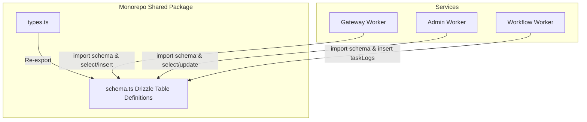

# 架构决策记录 (ADR) - Swarm 全服务（Gateway, Admin, Workflow）Drizzle ORM 全量整合与规范化重构方案

* 创建日期: 2026-06-16
* 状态: 已批准 (Approved)
* 作者: 首席全栈架构师

---

## 1. 架构定位
- **模块归属**: 后端跨服务共享模块 (`backend/packages/shared/`) 与各 Worker 独立运行期持久层。
- **重构对象**:
  - `@swarm/shared` 包 [MODIFY]：新增 `drizzle-orm` 依赖并定义并导出统一表结构 `src/schema.ts`。
  - `gateway` 服务 [MODIFY]：接入 Drizzle ORM，重构全部 Handlers (已完成 agents, 继续重构 auth, credits, tasks) 及中间件。
  - `workflow` 服务 [MODIFY]：引入 Drizzle ORM，重构 `workflow/src/utils.ts` 与 `workflow.ts` 主流程数据库读写。
  - `admin` 服务 [MODIFY]：引入 Drizzle ORM，重构管理后台的审计、角色权限微调和任务管控接口。
- **解耦设计**:
  - **解耦跨服务 Schema 维护**：由共享包 `@swarm/shared` 统一控制 Schema 的单一演进源，所有微服务直接以类型导入的方式和数据库表绑定，防止因字段修改导致的微服务同步失效。

---

## 2. 核心契约与 Monorepo 设计

### 2.1 依赖对齐
在共享包及各微服务中添加 `drizzle-orm` 依赖以保障打包与类型系统畅通。

### 2.2 共享库表结构声明 (`packages/shared/src/schema.ts`)
包含：`users`、`rolePermissions`、`tasks`、`taskLogs`、`userInvitations`、`adRewardLogs`、`creditsLedger`、`agents`、`adminAuditLogs`（共 9 张物理表）。

在 `packages/shared/src/types.ts` 中追加：
```typescript
export * from "./schema";
```

---

## 3. 控制流转规划

### 3.1 跨服务控制流架构


### 3.2 `workflow` 服务 ORM 流转
- 改造 `workflow/src/utils.ts` 中的 `appendTaskLog` 与 `updateTaskStatus`，采用 `drizzleDb.insert(taskLogs)` 和 `drizzleDb.update(tasks)` 替代手写 SQL。
- 改造 `workflow.ts` 主控中对 `agents` 表的拉取：
  ```typescript
  const agentConfigs = await drizzleDb.select().from(agents).where(inArray(agents.id, queryIds));
  ```

### 3.3 `admin` 服务 ORM 流转
- 重构 `admin/src/handlers/admin.ts` 中的管理后台功能。
  - 用户封禁：`drizzleDb.update(users).set({ isBanned: 1, bannedReason: ... })`。
  - 角色权限微调：`drizzleDb.insert(rolePermissions)` 等。

---

## 4. 防御设计
- **外键关联强物理限制**：Drizzle 编译期能确保插入的 `userId`、`taskId` 符合类型规范，前置阻断了因为传错外键导致的非法数据插入故障。
- **D1 事务隔离兜底**：`drizzleDb.batch(...)` 在三个 Worker 中提供完全的本地/并发事务回滚支持。
