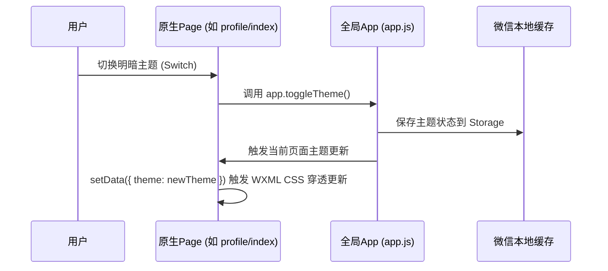

# ADR: 微信原生小程序全量功能迁移重塑设计文档 (LLD)

## 1. 架构定位与解耦设计
本项目从 UniApp (Vue3 + Vite) 体系完全向微信原生小程序（WXML + WXSS + JS + JSON）进行重写移植，以实现轻量化、原生渲染和极致运行速度。
- **UI 呈现与交互层**：利用 `TDesign Miniprogram` 官方原生组件库实现符合企业级规范的输入框、按钮、弹窗、下拉刷新及表格等组件。
- **原子化样式层**：利用微信预编译的 `tailwind.wxss` 快速实现各类排版，尽量避免自定义 WXSS 的编写。
- **与业务逻辑解耦**：
  - **网络层解耦**：所有 API 请求统一走 `utils/request.js`，内部统一处理 JWT 认证头及 TraceID。
  - **状态管理器解耦**：由于移除了 Pinia，利用微信小程序全局的 `getApp().globalData` 或本地缓存（`wx.getStorageSync`）进行登录状态、用户信息和主题模式的管理，页面的 `data` 仅作为局部视图状态机。

---

## 2. 核心契约与数据结构

### 2.1 登录与认证协议 (Login Contract)
- **请求契约 (LoginReq)**:
  ```typescript
  interface LoginReq {
    code: string;        // 微信临时登录凭证 (必填)
    nickname?: string;   // 微信昵称 (选填)
    avatarUrl?: string;  // 微信头像地址 (选填)
    inviterId?: string;  // 邀请人ID (选填)
  }
  ```
- **响应契约 (LoginRes)**:
  ```typescript
  interface LoginRes {
    token: string;       // JWT 访问令牌
    user: {
      id: string;
      nickname: string;
      avatarUrl: string;
      role: 'USER' | 'ADMIN';
      credits: number;
    }
  }
  ```

### 2.2 任务详情契约 (Task Detail Contract)
- **获取控制台日志 (TaskLogRes)**:
  ```typescript
  interface TaskLogRes {
    logs: Array<{
      timestamp: string;
      level: 'INFO' | 'WARN' | 'ERROR' | 'DEBUG';
      message: string;
    }>;
    status: 'PENDING' | 'RUNNING' | 'SUCCESS' | 'FAILED';
  }
  ```

---

## 3. 控制流转与生命周期说明

### 3.1 状态同步与主题流转


### 3.2 登录认证与路由拦截流转
由于原生微信小程序没有全局路由拦截器，我们在需要鉴权的页面（如 `task/index`、`profile/index` 等）的 `onShow` 生命周期内进行显式拦截。
- **拦截逻辑**：
  ```javascript
  onShow() {
    const token = wx.getStorageSync('authToken');
    if (!token) {
      wx.reLaunch({
        url: '/pages/login/login'
      });
    }
  }
  ```

---

## 4. 防御设计 (异常处理与可观测性)
1. **全链路 TraceID 注入**：所有网络请求在 `request.js` 内部自动生成 UUID 并注入 `X-Trace-Id` 头部。
2. **请求超时与容错**：在 `request.js` 中设置 10 秒超时。对 `5xx` 服务端异常和网络断开，统一捕获并在控制台以结构化 `console.error` 输出 TraceID 和堆栈，并展示 TDesign Toast 报错。
3. **明暗主题穿透适配**：在亮色模式下，页面外层元素包含 `theme-light` 类名。WXSS 使用 `page` CSS 变量覆盖机制，使得 TDesign 组件内部也能完美跟随主题（对于特殊的 TDesign 组件，添加特定的 class 进行定制覆盖）。
4. **登录失效兜底**：当接口返回 `401 Unauthorized` 状态码时，网络层自动清除本地 `authToken`，并弹出 Toast 提示后重定向至登录页。

---

## 5. 执行拆解 (Todo List)

### 阶段一：通用底座与登录页面 (Login)
- [ ] 编写 pages/login/login.json：注册 t-input、t-button。
- [ ] 编写 pages/login/login.wxml：实现动态光波背景、特色卡片及登录按钮。
- [ ] 编写 pages/login/login.js：实现自动免密登录检测、微信小程序登录 API 调用以及手动邀请码处理。
- [ ] 编写 pages/login/login.wxss：处理动态 Blob 动画及特殊排版。

### 阶段二：任务监控大盘 (Task Index & Task Detail)
- [ ] 编写 pages/task/index：
  - wxml: 实现 Bento 大卡、指标统计区、分段控制器筛选、任务卡片列表。
  - js: 包含列表请求、下拉刷新、条件过滤等。
  - json: 注册 t-segmented、t-badge、t-pull-down-refresh。
- [ ] 完善 pages/task/detail：
  - wxml: 终端大卡控制台日志输出、AI 诊断手风琴对话面板。
  - js: 定时轮询日志拉取、AI 交互面板数据联动。
  - json: 注册 t-collapse、t-collapse-panel、t-popup 等组件。

### 阶段三：个人中心 (Profile) 与智能体工作台 (Agent Manager)
- [ ] 编写 pages/profile/index：
  - 核心包含用户卡片、我的特权卡片列表、系统配置（深色模式 t-switch 开关，联动修改 App.toggleTheme()）。
- [ ] 编写 pages/agent/manager：
  - 渲染智能体列表卡片、编辑/创建智能体的滑出弹窗（t-popup）、参数滑块（t-slider）。

### 阶段四：管理员管控大盘 (Admin Dashboards)
- [ ] 编写 pages/admin/dashboard：提供 2x2 网格看板，统计全局用户数、活跃任务数等。
- [ ] 编写 pages/admin/users：实现用户表格，支持封禁、充值金币操作。
- [ ] 编写 pages/admin/tasks：管理全局执行的任务。
- [ ] 编写 pages/admin/agents：管理全局智能体模板与状态。
