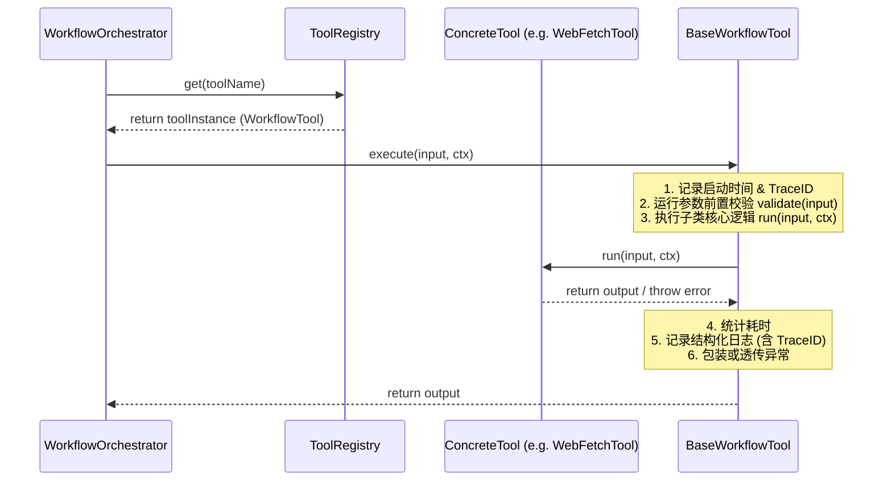

# 架构决策记录 (ADR) - 工具层（tools.ts）设计模式重构与优化

* 创建日期: 2026-06-16
* 状态: 已批准 (Approved)
* 作者: 首席全栈架构师

---

## 1. 架构定位
- **模块归属**: 后端工作流引擎工具层 (`backend/workers/workflow/src/tools.ts`)。
- **职责**: 负责执行具体的边缘微服务/接口调用（如网页抓取、天气查询、网页搜索、邮件通知、LLM处理等）。
- **外部依赖**: 
  - `@swarm/shared` 中的 `AI_MODELS` 模块。
  - Cloudflare Worker 的 `Env` 环境变量及 `AI` 绑定。
- **解耦设计**:
  - 原来散落在 `workflow.ts` 中的 `llm_chat` 工具，统一收敛并物理隔离到 `tools.ts` 中。
  - 各工具所需的 API Key 等外部凭证，不再通过函数参数传递，而是统一封装进 `ToolContext` 的 `env` 属性中，实现工具接口与具体业务环境变量的解耦。
  - `workflow.ts` 的 `runEdgeTool` 从原有的 `if-else` 分支匹配，重构为基于 **注册表模式 (Registry Pattern)** 的动态查找与执行，使其满足开闭原则（OCP）。

---

## 2. 核心契约
定义于 `tools.ts` 中，为所有工具的入参、上下文和出参规定强类型限制：

```typescript
// 1. 工具上下文接口，确保 TraceID 和 Worker Env 能够传递到每个工具中
export interface ToolContext {
  traceId: string;
  env: {
    DB: any;
    AI: any;
    WEATHER_API_KEY?: string;
    SEARCH_API_KEY?: string;
    EMAIL_API_KEY?: string;
    EMAIL_FROM?: string;
    [key: string]: any;
  };
}

// 2. 统一的工具接口契约
export interface WorkflowTool<TInput = any, TOutput = string> {
  readonly name: string;
  readonly description: string;
  execute(input: TInput, ctx: ToolContext): Promise<TOutput>;
}
```

---

## 3. 控制流转
### 3.1 核心流转图


### 3.2 设计模式选型理由
1. **策略模式 (Strategy Pattern)**: 每个工具（如网页抓取、天气查询）实现为独立的策略类。在工作流引擎决策时，能够根据工具名称动态路由到不同的策略，便于自由扩展。
2. **模板方法模式 (Template Method Pattern)**: 通过抽象基类 `BaseWorkflowTool` 定义工具执行的主骨架（包括性能统计、防御式参数校验入口、TraceID 结构化日志输出和崩溃熔断处理），而将具体的业务逻辑 `run` 和参数校验 `validate` 延迟到子类中实现。这样能彻底消除重复代码。
3. **注册表模式 (Registry Pattern)**: 使用 `ToolRegistry` 进行工具注册。调用方直接根据名称获取实例，使得添加新工具无需修改主控代码，实现即插即用。
4. **门面模式 (Facade Pattern)**: 为了保障向后兼容，保持原有的顶层导出函数（如 `executeWebFetch`），其内部直接委派给 `ToolRegistry` 的对应工具实例去执行，避免破坏 `workflow.ts` 其他存量代码的编译。

---

## 4. 防御设计
为确保工具执行在面对各类环境故障和异常输入时能够优雅兜底，我们设计了以下防御策略：

1. **非法参数异常防御**:
   - **表现**: 传入的 URL 为空或非 `http` 开头，或者邮件收件人未提供。
   - **策略**: 在各个策略类的 `validate` 中进行强校验，若不通过，直接抛出 `InvalidParameterError`。基类捕获后输出包含 TraceID 的 ERROR 日志，并返回以 `[ERROR]` 开头的友好提示语。
2. **API Key 缺失与降级防御**:
   - **表现**: 天气 API、搜索 API 或邮件 API 缺失环境变量配置。
   - **策略**: 
     - 搜索 API 缺失时：自动降级使用免费的 DuckDuckGo API，并输出 WARN 级别日志。
     - 邮件 API 缺失时：自动切入模拟发送（Simulated）状态，将邮件内容写入日志以供审计，不影响工作流主链路。
     - 天气 API 缺失时：直接返回 `[ERROR] 天气API密钥未配置...`。
3. **网络请求超时与熔断机制**:
   - **表现**: 抓取目标网站响应极慢，导致工作流阻塞。
   - **策略**: 所有 fetch 请求强制注入 `AbortSignal.timeout(15000)`（15秒超时），并在超时发生时捕获异常，输出包含 TraceID 的错误堆栈，及时释放系统连接资源。
4. **全链路 TraceID 日志记录**:
   - **策略**: 工具基类在每次执行开始、成功和失败时，均输出带有 `[${traceId}] [Tool - ${name}]` 前缀的结构化日志。敏感数据（如具体授权 Key 等）在日志打印前将被严格脱敏。
