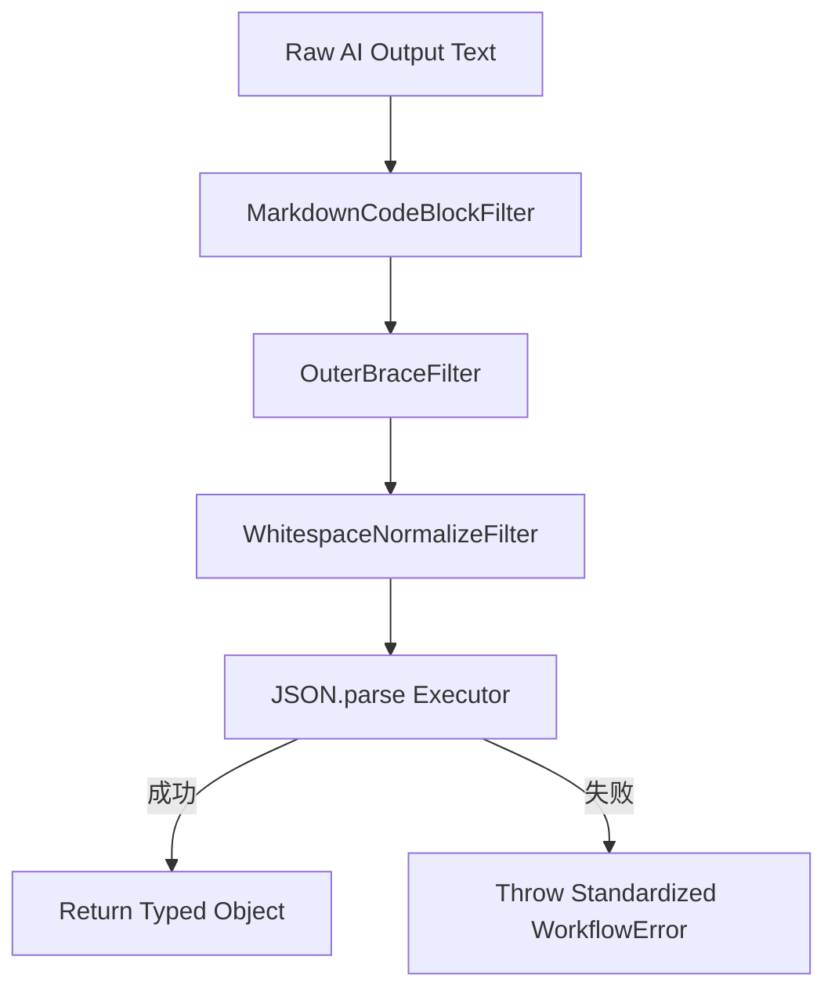

# 架构决策记录 (ADR) - 工具辅助函数层（utils.ts）设计模式重构与大厂规范优化

* 创建日期: 2026-06-16
* 状态: 已批准 (Approved)
* 作者: 首席全栈架构师

---

## 1. 架构定位
- **模块归属**: 后端工作流引擎辅助类库 (`backend/workers/workflow/src/utils.ts`)。
- **职责**: 负责运行期任务日志记录、强类型任务状态变更控制，以及对 AI 生成的半结构化 JSON 内容进行防御性清洗与解析。
- **外部依赖**: 
  - Cloudflare D1 数据库实例。
- **解耦设计**:
  - **解耦日志存储介质**：剥离日志框架对 D1 数据库的直接强依赖。通过 Appender 接口规范日志的输出通道，使得日志 system 与底层具体存储介质完全解耦。
  - **解耦清洗逻辑**：将复杂的 JSON 正则清洗、换行符转义、容错解析步骤解耦到独立的 Clean 过滤器中，消除多重 if-else 嵌套。
  - **强类型契约**：使用 TypeScript Enum 替代状态魔法字符串，保证前后端概念完全对齐。

---

## 2. 核心契约 (TypeScript Interfaces)

```typescript
// 1. 任务状态 Enum 契约，杜绝魔法字符串
export enum TaskStatus {
  RUNNING = "RUNNING",
  SUCCESS = "SUCCESS",
  FAILED = "FAILED",
}

// 2. 统一日志级别 Enum
export enum LogLevel {
  INFO = "INFO",
  WARN = "WARN",
  ERROR = "ERROR",
}

// 3. 日志分发 Appender 接口
export interface LogAppender {
  append(taskId: string, level: LogLevel, message: string): Promise<void>;
}

// 4. JSON 清洗处理器接口 (职责链)
export interface JsonCleanFilter {
  clean(text: string): string;
}
```

---

## 3. 控制流转
### 3.1 控制流转图 (职责链模式 - JSON 清洗解析)


### 3.2 设计模式选型理由
1. **多通道日志模式 (Appender Pattern / Strategy Pattern)**: 
   `TaskLogger` 控制器负责协调并执行注册好的 `LogAppender` 列表（如 `ConsoleAppender` 和 `D1DatabaseAppender`）。该模式允许我们在不修改业务逻辑的前提下，极易横向扩展其他日志存储通道（如 Sentry, Kibana 或 Kafka）。
2. **职责链模式 (Chain of Responsibility)**:
   对于 AI 生成的非标准格式 JSON（带有 Markdown 标记、首尾夹杂说明性文字、转义符缺失等问题），我们通过一组职责单一的清洗过滤器进行流水线式处理，使每一段解析过滤器的代码均在 10 行以内，杜绝超过 40 行的“胖函数”。
3. **状态译码表映射 (State-to-Label Map)**:
   使用静态只读的常量映射表，取代繁重的逻辑分支切换，使代码更加直观和具备声明式特点。

---

## 4. 防御设计
1. **异常1：D1 写入日志时自身崩溃**:
   - **策略**: Appender 捕获并输出到 `console.error`，但不向上级抛出异常，防止“记录故障”本身的失败打断正常的业务流。
2. **异常2：非法的 TaskStatus 变更**:
   - **策略**: 方法前置断言，判断传入 Status 是否存在于 `TaskStatus` 中，防止因拼写错误将脏数据写入数据库。
3. **异常3：JSON 解析彻底失败**:
   - **策略**: 在职责链末端抛出统一包装后的业务异常 `JSONParseException`，附带完整 TraceID、原始输入和清洗后的内容，坚决不吞掉任何底层核心异常。
