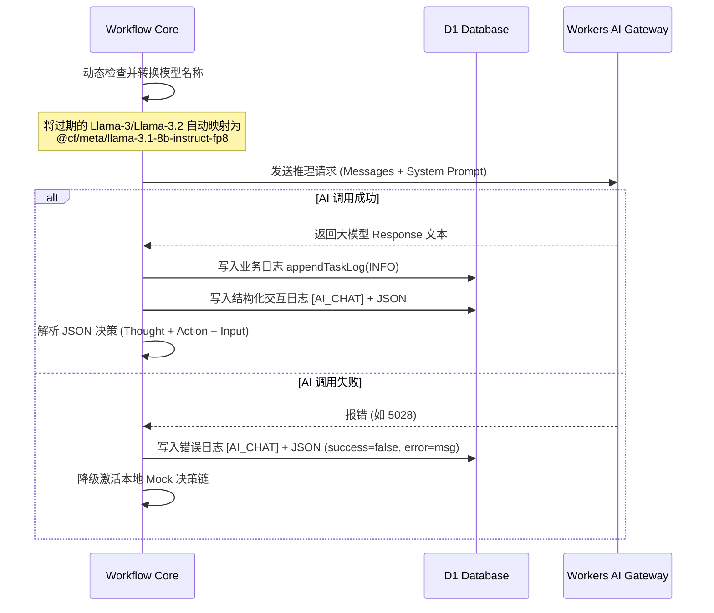

# Architecture Decision Record (ADR) - 多智能体编排引擎升级与终端可观测性架构重构

## 状态
已批准 (Approved)

## 日期
2026-06-16

## 1. 架构定位 (Architectural Position)

本项目包含两大核心痛点改进：
1. **多智能体编排决策退化与模型失效**：由于 `@cf/meta/llama-3-8b-instruct` 被官方正式废弃（报 5028 错误），导致 Workflow 在决策阶段发生 JSON 解析异常或调用崩溃，进而降级为 Hardcoded Mock 流程。本设计通过引入 **大模型活跃期运行映射** 和 **System Prompt JSON 强制范式**，使编排引擎恢复真正的智能动态 ReAct 规划。
2. **终端可观测性缺失与界面布局缺陷**：目前的日志仅记录简要的步骤文字，无法追踪大模型的 Prompt 及 Response；同时移动端/H5 界面高度没有绝对锁定，导致内容增多时页面整体滚动、头部与底部无法固定。本设计通过制定 **`[AI_CHAT]` 结构化日志透传契约**，结合前端 **赛博极客折叠面板** 和 **绝对视口 Flex 约束**，彻底解决上述问题。

---

## 2. 核心契约 (Contracts & Specifications)

### 2.1 结构化 AI 日志透传协议
当 Workflow 执行 AI 推理（Supervisor 规划或 Worker 执行）时，除了标准的业务 INFO 日志，还将生成一条结构化 `[AI_CHAT]` 日志，存储于 `task_logs.message` 中。其格式定义为：

```typescript
// 标识头部："[AI_CHAT] " + JSON.stringify(AIChatLogPayload)
interface AIChatLogPayload {
  type: "AI_CHAT_LOG";
  agentName: string;          // 当前执行的智能体名称 (如 "主控协调官", "网页采集专家")
  model: string;              // 实际调用的底层大模型标识
  messages: Array<{           // 输入大模型的完整 Prompt/上下文列表
    role: "system" | "user" | "assistant";
    content: string;
  }>;
  response: string;           // 大模型返回的原始未经裁剪的 Response
  success: boolean;           // 调用是否成功
  error?: string;             // 失败时的错误堆栈
}
```

### 2.2 大模型运行时升级映射表 (Supported Model Mapper)
为保障存量历史任务数据的高可用性，系统在运行时提供动态重映射，任何指向已下线模型的配置，将静默重定向至目前活跃且受推荐的 Llama 3.1 模型：
- 输入：`@cf/meta/llama-3-8b-instruct` ➔ 映射至：`@cf/meta/llama-3.1-8b-instruct-fp8`
- 输入：`@cf/meta/llama-3.2-3b-instruct` ➔ 映射至：`@cf/meta/llama-3.1-8b-instruct-fp8`（Llama-3.1 8B 具备更好的 JSON 指令遵循和复杂的 Tool-calling / ReAct 规划能力）

---

## 3. 控制流转 (Control Flow & Process Logic)

### 3.1 后端 Workflow 推理与日志沉淀流


---

## 4. 界面重构与防御设计 (UI Redesign & Defensive Design)

### 4.1 前端终端视口布局绝对锁定
为了杜绝头部与底部发生混滚或偏离视口的问题，彻底弃用不稳定的 `height: 100vh` 纯 Flex 流式高度：
- **布局容器**：使用绝对定位铺满视口 `position: absolute; top: 0; bottom: 0; left: 0; right: 0;` 并设置 `overflow: hidden`。
- **头部与底部**：外包独立的 Header 与 Footer 容器，显式赋予 `flex-shrink: 0;`。
- **终端区域**：设置 `flex: 1; min-height: 0;`。这样即使内部日志有上千行，也只会在 `scroll-view` 内部滚动，绝对不会撑开或挤压外部视图。

### 4.2 鲁棒性 JSON 清洗算法 (Robust JSON Parser)
大模型在输出 JSON 时，经常会附加 ` ```json ` 等 Markdown 块或前置废话。我们将重构 `safeParseJSON`，增加防御：
1. 使用惰性匹配 `[\s\S]*?` 提取最外层的大括号 `{` 到 `}`。
2. 过滤掉所有不合法的控制字符（例如未经转义的换行符）。
3. 增加容错，若首轮解析失败，尝试去掉 AI 前后的解释文字再次清洗解析。

---

## 5. 模块修改明细 (Proposed Changes)

### 5.1 后端 Workflow 引擎
#### [workflow.ts](file:///Users/zhangjiahao/IdeaProjects/swarm/backend/workers/workflow/src/workflow.ts)
- 引入 `getSupportedModel(model: string)` 函数，自动进行模型升级重映射。
- 升级 `DEFAULT_MODEL` 为 `@cf/meta/llama-3.1-8b-instruct-fp8`。
- 升级 `callLlmChat` 接口，在调用完毕后，无论是成功还是异常，均在数据库中写入 `[AI_CHAT]` 开头的结构化日志。
- 重构 `safeParseJSON` 函数，提升解析的鲁棒性，保障 ReAct 编排不中断。

### 5.2 数据库配置升级
#### [schema.sql](file:///Users/zhangjiahao/IdeaProjects/swarm/backend/schema.sql)
- 修改 `agents` 表的 `model` 字段默认值为 `'@cf/meta/llama-3.1-8b-instruct-fp8'`。
- 将内置种子数据（网页采集专家、深度分析师、邮件通知官）中的 `model` 升级为 `'@cf/meta/llama-3.1-8b-instruct-fp8'`。

### 5.3 前端终端可观测性与页面布局
#### [detail.vue](file:///Users/zhangjiahao/IdeaProjects/swarm/frontend/src/pages/task/detail.vue)
- 重构布局样式，使用绝对定位与 `flex-shrink: 0` 锁定头部与底部。
- 重构日志渲染逻辑，加入 `[AI_CHAT]` 的过滤。
- 新增 `AIChatDetails` 高阶极客折叠面板，支持展开查看模型的 Prompt、System、Messages、Response，支持一键复制代码。
- 引入代码高亮样式（基于赛博朋克深黑主题）来美化展示日志中的 JSON 和 Markdown 信息。
