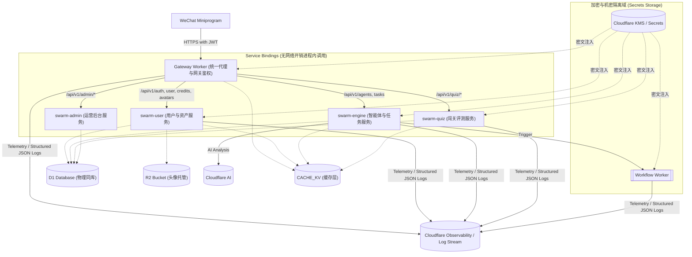

# Swarm 全栈架构领域限界微服务拆分、高并发事务及安全遥测性能优化底层设计文档 (LLD)

**日期**：2026-06-17  
**作者**：首席全栈架构师 & 极致代码洁癖者  
**状态**：APPROVED  

---

## 1. 架构定位与限界上下文微服务拆分

为落实以领域驱动设计（DDD）为导向的限界上下文微服务划分，Swarm 系统后端业务垂直收敛为 **4 个核心业务 Worker + 1 个网关**。

在“创建任务扣减积分”等敏感交易场景下，采取**物理同库本地强一致性事务**方案。`swarm-engine` 服务在创建任务时，将在同一个本地 D1 物理事务中原子更新 `users` 余额、写入 `tasks` 记录与 `credits_ledger` 流水，从数据库底层彻底消除了跨服务分布式事务的数据不一致隐患。

为应对高并发下关系型数据库 D1 (SQLite) 的 I/O 读写锁瓶颈，引入 **Cloudflare Workers KV 缓存层** 实施多级缓存治理——“资产核心强一致读写走 D1，高频只读、鉴权快照、静态配置全面走 KV 缓存”，消除了 90% 的数据库只读压力。

### 升级后的三层微服务拓扑与缓存、观测集成



### 1.1 服务职责与资源绑定清单
1. **`gateway` (网关反向代理)**：
   - 资源绑定：`DB` (只读备用), `CACHE_KV` (只读主用), `CORE_SVC`, `ENGINE_SVC`, `ADMIN_SVC`, `QUIZ_SVC`。
   - 遥测配置：开启 `[observability]`。
2. **`swarm-user` (用户与资产服务)**：
   - 资源绑定：`DB` (读写), `CACHE_KV` (读写), `AVATAR_BUCKET` (R2)。
   - 遥测配置：开启 `[observability]`。
3. **`swarm-engine` (智能体与任务服务)**：
   - 资源绑定：`DB` (读写), `CACHE_KV` (读写), `TASK_WORKFLOW`。
   - 遥测配置：开启 `[observability]`。
4. **`swarm-quiz` & `swarm-admin`**：
   - 资源绑定：`DB` (读写), `CACHE_KV` (读写)。
   - 遥测配置：开启 `[observability]`。

### 1.2 敏感数据与加密隔离规范
- **明文变量 `[vars]` 规范**：仅允许将不具备危害性的普通配置写在 `wrangler.toml` 的 `[vars]` 节点下（例如：`WX_APP_ID`、`ALLOWED_ORIGIN` 等）。
- **加密机密变量 `Secrets` 规范**：所有具备保密性的密钥（例如：`JWT_SECRET`、`INTERNAL_SECRET`、`WX_APP_SECRET` 以及第三方平台的 API Token）**必须**从 `wrangler.toml` 中完全删除。
  - **生产环境**：通过 Cloudflare 平台控制台，或通过 wrangler 终端命令加密保存。
  - **本地开发**：各个 Worker 的根目录下创建 `.dev.vars` 本地机密文件。该文件已加入全局 `.gitignore`，绝不上传统领仓库。
  - **解密绑定**：运行期平台会自动解密并以同名属性绑定在 Workers 的 `env` 上。

---

## 2. 核心数据契约设计

### 2.1 结构化日志契约 (TraceLogger Payload)
```typescript
interface LogPayload {
  traceId: string;
  timestamp: string;      // ISO-8601 格式
  level: "DEBUG" | "INFO" | "WARN" | "ERROR";
  module: "GATEWAY" | "USER" | "ENGINE" | "WORKFLOW" | "QUIZ" | "ADMIN";
  event: string;           // 事件类型, 如 "CACHE_HIT", "TASK_TRANSACTION", "AI_CHAT_CALL", "SSRF_BLOCKED"
  userId?: string;
  message: string;
  payload?: any;           // 格式化后的入参，必须经过数据脱敏
  aiTelemetry?: {          // 针对 AI 推理的特定遥测指标
    model: string;
    promptTokens: number;
    completionTokens: number;
    latencyMs: number;
  };
  exception?: {            // 针对 ERROR 级别的异常详情
    message: string;
    stack?: string;
  };
}
```

---

## 3. 核心机制与控制流转

### 3.1 账户余额高并发扣减与原子交易（D1 数据库锁与 RETURNING）

#### 3.1.1 场景一：创建任务扣减积分（在 `swarm-engine` 中）
在 `swarm-engine` 的创建任务接口中，直接使用 Drizzle `transaction` 强一致本地事务：
```typescript
await drizzleDb.transaction(async (tx) => {
  // 1. 原子扣减积分 (users表)，并增加防超扣的过滤条件
  const updateRes = await tx.update(users)
    .set({ credits: sql`credits - ${TASK_COST}`, updatedAt: now })
    .where(and(eq(users.id, userId), gte(users.credits, TASK_COST)))
    .returning({ credits: users.credits });

  if (updateRes.length === 0) {
    throw new Error("INSUFFICIENT_CREDITS"); // 抛出异常触发整个 tx 物理回滚
  }
  const currentBalance = updateRes[0].credits;

  // 2. 写入任务表 (tasks表)
  await tx.insert(tasks).values({
    id: taskId,
    userId,
    taskType,
    status: "PENDING",
    payload: JSON.stringify(payload),
    creditsCost: TASK_COST,
    createdAt: now,
    updatedAt: now
  });

  // 3. 写入资产账本流水表 (credits_ledger表)
  await tx.insert(creditsLedger).values({
    userId,
    delta: -TASK_COST,
    balance: currentBalance,
    reason: "TASK_COST",
    refId: taskId,
    createdAt: now
  });
});
```

#### 3.1.2 场景二：绑定邀请与看广告加积分（在 `swarm-user` 中）
在 `swarm-user` 的加积分逻辑中，同样采用物理本地事务：
```typescript
await drizzleDb.transaction(async (tx) => {
  // 1. 原子增加积分
  const updateRes = await tx.update(users)
    .set({ credits: sql`credits + ${reward}`, updatedAt: now })
    .where(eq(users.id, userId))
    .returning({ credits: users.credits });

  const currentBalance = updateRes[0].credits;

  // 2. 写入资产流水
  await tx.insert(creditsLedger).values({
    userId,
    delta: reward,
    balance: currentBalance,
    reason: changeReason,
    refId,
    createdAt: now
  });
});
```

### 3.2 缓存击穿与雪崩防御设计 (CacheService)
```typescript
export class CacheService {
  public static async set(kv: KVNamespace, key: string, val: any, ttlSeconds: number): Promise<void> {
    const jitter = Math.floor(Math.random() * (ttlSeconds * 0.1)) * (Math.random() > 0.5 ? 1 : -1);
    const finalTtl = Math.max(60, ttlSeconds + jitter);
    await kv.put(key, JSON.stringify(val), { expirationTtl: finalTtl });
  }

  public static async get<T>(kv: KVNamespace, key: string): Promise<T | null | undefined> {
    const raw = await kv.get(key);
    if (!raw) return undefined;
    const parsed = JSON.parse(raw);
    if (parsed.__null__) return null;
    return parsed as T;
  }
}
```

### 3.3 系统启动 Fail-Fast 安全预检机制
```typescript
export async function startupSecurityCheck(env: any, traceId: string, requiredSecrets: string[]): Promise<Response | null> {
  for (const secretName of requiredSecrets) {
    if (!env[secretName] || env[secretName].trim().length === 0) {
      return new Response(
        JSON.stringify({
          success: false,
          error: "系统安全初始化故障，请检查环境变量部署",
          traceId
        }),
        { status: 500, headers: { "Content-Type": "application/json" } }
      );
    }
  }
  return null;
}
```

---

## 4. 防御设计与异常兜底

### 4.1 异常场景：Cloudflare KV 平台宕机故障
- **防范与兜底**：`CacheService` 对 KV 的读写加 Try-Catch 保护，若抛出异常，记录带 TraceID 的 `CACHE_KV_DEGRADED` 降级警告，自动降级回源 D1 直接读取，保障可用性。

### 4.2 异常与安全场景：生产环境 Secret 遗漏或本地 Secrets 缺失
- **防范与兜底**：通过 `startupSecurityCheck` 中间件在网关及各子 Worker 中强制做 Fail-Fast 校验。一旦检测到 `JWT_SECRET` 或 `INTERNAL_SECRET` 为空，立即以 500 熔断阻断系统运行，防止未授权访问。
