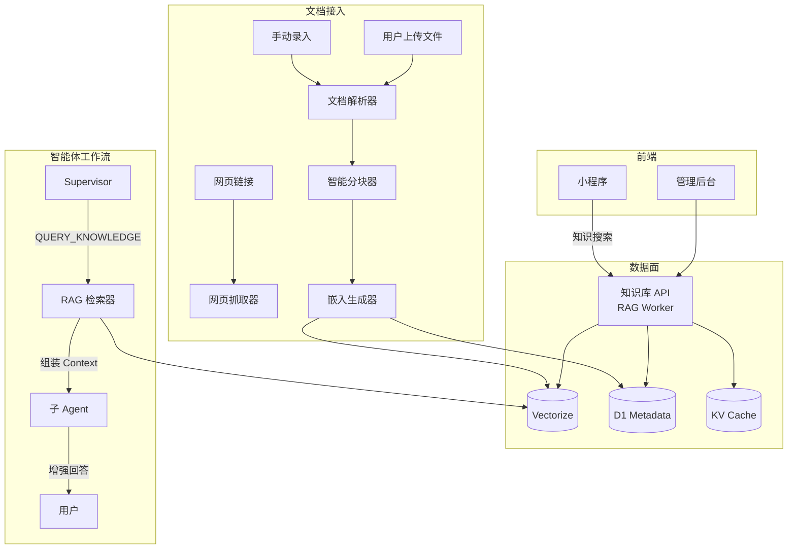

# 架构决策记录 (ADR) - RAG 知识库系统设计

* 创建日期: 2026-06-20
* 状态: 已批准 (Approved, 2026-06-22)
* 作者: 首席全栈架构师

---

## 1. 架构定位

- **模块归属**: 新增 RAG Worker (`backend/workers/rag/`) + 共享层扩展 (`@swarm/shared`)
- **职责**: 提供企业级知识库的**文档接入 → 智能分块 → 向量化 → 存储检索**全链路能力，并为现有的多智能体编排工作流注入检索增强生成（RAG）能力
- **外部依赖**:
  - Cloudflare **Vectorize** — 向量数据库（存储文档 chunk 向量）
  - Cloudflare **Workers AI** — 文本嵌入模型（multilingual-e5-large）
  - Cloudflare **D1** — 文档元数据、知识库配置持久化
  - Cloudflare **KV** — 热门检索结果缓存（防重复向量计算）
  - 已有的 `backend/workers/workflow` — Supervisor 决策 + Agent 回答注入上下文
  - 已有的 `backend/workers/engine` — 触发文档解析任务
- **解耦设计**:
  - RAG 作为独立 Worker 部署，通过 Service Binding 被其他 Worker 调用
  - 文档解析/分块/向量化走异步队列（Durable Objects 或 Workflows），不阻塞 API 响应
  - 检索结果以纯文本 context 注入，LLM 无感知背后是 RAG

---

## 2. 核心契约

### 2.1 新增 D1 表

```sql
-- ══════════════════════════════════════════════════
-- 表 R1: knowledge_bases（知识库集合）
-- ══════════════════════════════════════════════════
CREATE TABLE IF NOT EXISTS knowledge_bases (
  id              TEXT PRIMARY KEY,
  name            TEXT NOT NULL,
  description     TEXT,
  user_id         TEXT REFERENCES users(id),        -- 所属用户，NULL=系统公共库
  is_public       INTEGER NOT NULL DEFAULT 0,       -- 0=私有, 1=公开
  embedding_model TEXT NOT NULL DEFAULT '@cf/intfloat/multilingual-e5-base',
  chunk_size      INTEGER NOT NULL DEFAULT 500,     -- 分块字符数
  chunk_overlap   INTEGER NOT NULL DEFAULT 100,     -- 分块重叠字符数
  created_at      TEXT NOT NULL DEFAULT (strftime('%Y-%m-%dT%H:%M:%fZ','now')),
  updated_at      TEXT NOT NULL DEFAULT (strftime('%Y-%m-%dT%H:%M:%fZ','now'))
);

-- ══════════════════════════════════════════════════
-- 表 R2: documents（文档主表）
-- ══════════════════════════════════════════════════
CREATE TABLE IF NOT EXISTS documents (
  id              TEXT PRIMARY KEY,
  kb_id           TEXT NOT NULL REFERENCES knowledge_bases(id) ON DELETE CASCADE,
  title           TEXT NOT NULL,
  source_type     TEXT NOT NULL CHECK(source_type IN ('UPLOAD','WEB_SCRAPE','MANUAL')),
  source_url      TEXT,                             -- 网页来源 URL
  raw_content     TEXT NOT NULL,                    -- 提取后的纯文本内容
  chunk_count     INTEGER NOT NULL DEFAULT 0,
  status          TEXT NOT NULL DEFAULT 'PENDING'
                  CHECK(status IN ('PENDING','PROCESSING','READY','FAILED')),
  error_message   TEXT,                             -- 处理失败原因
  file_name       TEXT,                             -- 上传文件名
  file_size       INTEGER,                          -- 文件字节数
  created_by      TEXT REFERENCES users(id),
  created_at      TEXT NOT NULL DEFAULT (strftime('%Y-%m-%dT%H:%M:%fZ','now')),
  updated_at      TEXT NOT NULL DEFAULT (strftime('%Y-%m-%dT%H:%M:%fZ','now'))
);
CREATE INDEX IF NOT EXISTS idx_documents_kb_id ON documents(kb_id);
CREATE INDEX IF NOT EXISTS idx_documents_status ON documents(status);

-- ══════════════════════════════════════════════════
-- 表 R3: document_chunks（文档分块元数据）
-- ══════════════════════════════════════════════════
CREATE TABLE IF NOT EXISTS document_chunks (
  id              TEXT PRIMARY KEY,
  document_id     TEXT NOT NULL REFERENCES documents(id) ON DELETE CASCADE,
  kb_id           TEXT NOT NULL REFERENCES knowledge_bases(id) ON DELETE CASCADE,
  chunk_index     INTEGER NOT NULL,
  chunk_text      TEXT NOT NULL,
  vector_index_id TEXT,                             -- Vectorize 中的向量 ID（格式: `{kb_id}:{chunk_id}`）
  token_count     INTEGER DEFAULT 0,
  created_at      TEXT NOT NULL DEFAULT (strftime('%Y-%m-%dT%H:%M:%fZ','now'))
);
CREATE INDEX IF NOT EXISTS idx_chunks_doc_id ON document_chunks(document_id);
CREATE INDEX IF NOT EXISTS idx_chunks_kb_id ON document_chunks(kb_id);
```

### 2.2 TypeScript 接口定义

新增到 `packages/shared/src/types.ts`：

```typescript
// ══════════════════════════════════════════════════
// 6. RAG 知识库模块类型
// ══════════════════════════════════════════════════

// ---- 知识库 ----
export interface KnowledgeBaseRow {
  id: string;
  name: string;
  description: string | null;
  user_id: string | null;
  is_public: number;
  embedding_model: string;
  chunk_size: number;
  chunk_overlap: number;
  created_at: string;
  updated_at: string;
}

export interface KnowledgeBaseDTO {
  id: string;
  name: string;
  description?: string;
  userId?: string;
  isPublic: boolean;
  embeddingModel: string;
  chunkSize: number;
  chunkOverlap: number;
  documentCount: number;
  createdAt: string;
  updatedAt: string;
}

export interface CreateKnowledgeBaseReq {
  name: string;
  description?: string;
  isPublic?: boolean;
  chunkSize?: number;    // 默认 500
  chunkOverlap?: number; // 默认 100
}

// ---- 文档 ----
export type DocumentSourceType = 'UPLOAD' | 'WEB_SCRAPE' | 'MANUAL';
export type DocumentStatus = 'PENDING' | 'PROCESSING' | 'READY' | 'FAILED';

export interface DocumentRow {
  id: string;
  kb_id: string;
  title: string;
  source_type: DocumentSourceType;
  source_url: string | null;
  raw_content: string;
  chunk_count: number;
  status: DocumentStatus;
  error_message: string | null;
  file_name: string | null;
  file_size: number | null;
  created_by: string | null;
  created_at: string;
  updated_at: string;
}

export interface DocumentDTO {
  id: string;
  kbId: string;
  title: string;
  sourceType: DocumentSourceType;
  sourceUrl?: string;
  chunkCount: number;
  status: DocumentStatus;
  errorMessage?: string;
  fileName?: string;
  fileSize?: number;
  createdAt: string;
  updatedAt: string;
}

export interface AddDocumentByUrlReq {
  kbId: string;
  url: string;
  title?: string;       // 可选自定义标题，默认从网页 <title> 提取
}

export interface AddDocumentManualReq {
  kbId: string;
  title: string;
  content: string;      // 手动录入的正文
}

// ---- 检索 ----
export interface SearchKnowledgeReq {
  kbId: string;
  query: string;
  topK?: number;        // 默认 5
  minScore?: number;    // 最低相似度阈值，默认 0.5
}

export interface KnowledgeChunkDTO {
  chunkId: string;
  documentId: string;
  documentTitle: string;
  kbId: string;
  chunkIndex: number;
  content: string;
  score: number;
}

export interface SearchKnowledgeRes {
  results: KnowledgeChunkDTO[];
  totalChunks: number;
}

// ---- RAG Agent 上下文注入 ----
export interface RAGContextInjectReq {
  kbIds: string[];        // 要检索的知识库列表
  query: string;          // 用户原始问题或当前任务目标
  maxChunks?: number;     // 最大注入 chunk 数，默认 5
  minScore?: number;      // 最低相似度，默认 0.4
}

export interface RAGContextInjectRes {
  context: string;        // 已组装好的纯文本上下文（可直接注入 LLM）
  chunks: KnowledgeChunkDTO[];
}
```

### 2.3 Vectorize 索引配置

```toml
# backend/workers/rag/wrangler.toml 新增
[[vectorize]]
binding = "VECTORIZE"
index_name = "swarm-knowledge"
```

索引维度需与嵌入模型对齐：

| 模型 | 维度 | 距离度量 |
|------|------|---------|
| `@cf/intfloat/multilingual-e5-base` | 768 | cosine |
| `@cf/baai/bge-base-en-v1.5` | 768 | cosine |

**默认选择 `multilingual-e5-base`（768 维，支持中文）。**

创建索引命令：
```bash
wrangler vectorize create swarm-knowledge --dimensions=768 --metric=cosine
```

### 2.4 环境变量

| 变量 | 所属 Worker | 说明 |
|------|-------------|------|
| `VECTORIZE` 绑定 | rag | Vectorize 索引绑定 |
| `AI` 绑定 | rag | Workers AI 用于生成嵌入 |
| `RAG_PARSER_TIMEOUT` | rag | 文档解析超时秒数，默认 60 |

---

## 3. 控制流转

### 3.1 整体架构图



### 3.2 文档接入流程（以网页抓取为例）

```
用户/管理员 发起添加文档请求
       │
       ▼
  1. POST /api/v1/kb/document/url
     └─ 参数: { kbId, url, title? }
       │
       ▼
  2. RAG Worker 验证 kb 存在性 → 记录 documents 表 (status=PENDING)
       │
       ▼
  3. 启动 Cloudflare Workflow 异步处理文档
     └─ WorkflowEntrypoint: DocumentProcessWorkflow
     └─ Params: { docId, kbId, sourceType, sourceUrl?, rawContent? }
       │
       ├─ Step 3a: fetch_document
       │   网页抓取 → 调用 web_fetch 逻辑获取 HTML
       │   重试策略: 最多 3 次，每次间隔 5s
       │   HTML→纯文本：提取 <title> + <article>/<main> 正文
       │
       ├─ Step 3b: chunk_document
       │   智能分块 (RecursiveCharacterTextSplitter)
       │   中文感知：按段落 → 句子 → 固定长度递归分割
       │   默认 chunk_size=500, chunk_overlap=100
       │   更新文档 title 和 chunk_count
       │
       ├─ Step 3c: generate_embeddings
       │   批量生成嵌入向量
       │   调用 Workers AI: @cf/intfloat/multilingual-e5-base
       │   每个 chunk 前加 "passage: " 前缀（e5 模型要求）
       │   ⚡ 并发控制：每次最多 10 个 chunk 并行嵌入
       │
       ├─ Step 3d: store_vectors
       │   写入 Vectorize:
       │     upsert({ id: "{kbId}:{chunkId}", values: [...] })
       │   写入 D1 document_chunks 表
       │
       └─ Step 3e: finalize
           更新 documents.status = 'READY'
           清除该知识库的 KV 缓存
       │
       ▼
  4. 前端轮询或推送通知文档"已就绪"
```

### 3.3 检索流程（Agent 上下文注入）

```
Agent 需要回答问题 / Supervisor 需决策
       │
       ▼
  1. RAG Worker: POST /api/v1/rag/inject
     └─ 参数: { kbIds, query, maxChunks?, minScore? }
       │
       ▼
  2. 检查 KV 缓存 (key="rag:{kbId}:{queryHash}")
     ├─ HIT → 直接返回缓存的 context
     └─ MISS → 继续
       │
       ▼
  3. 生成查询向量 (query embedding)
     └─ Workers AI: @cf/intfloat/multilingual-e5-base
     └─ 前缀 "query: " + query
       │
       ▼
  4. Vectorize 向量检索
     └─ query(vector, topK=5, minScore=0.4)
     └─ namespace = kbId（通过 index metadata 过滤）
       │
       ▼
  5. 从 D1 回查完整 chunk 文本
     └─ WHERE id IN (vectorResultIds)
       │
       ▼
  6. 组装上下文文本
     ┌─────────────────────────────────────────────┐
     │ 以下是从知识库中检索到的参考信息：            │
     │                                             │
     │ 【文档标题 1 - 片段 1/3】                    │
     │ ...  chunk_text  ...                        │
     │                                             │
     │ 【文档标题 2 - 片段 1/2】                    │
     │ ...  chunk_text  ...                        │
     └─────────────────────────────────────────────┘
       │
       ▼
  7. 注入当前 Agent 的 messages (system prompt 末尾)
     └─ 若 context 为空 → 不注入，不干扰 Agent 原有行为
       │
       ▼
  8. 异步写入 KV 缓存 (TTL=300s)
```

### 3.4 智能体工作流集成

#### 方案 A：Supervisor 自动检索（推荐，覆盖"路由决策增强"）

Supervisor 的 system prompt 中新增一条约束：

> **知识库查询能力**：如果你需要参考企业内部知识，请使用 `QUERY_KNOWLEDGE` 动作查询知识库。查询结果会自动注入到下一轮 Agent 的上下文中。

Supervisor 新增动作：

```typescript
// 新增动作类型
{
  "thought": "用户问的是公司内部流程，需要先查询知识库",
  "action": "QUERY_KNOWLEDGE",
  "kb_ids": ["kb-xxxx"],      // 目标知识库
  "query": "内部审批流程",
  "maxChunks": 5
}
```

执行逻辑：在 `workflow.ts` 的 ReAct 循环中新增分支：

```
action === "QUERY_KNOWLEDGE"
  → 调用 RAG Worker (通过 Service Binding)
  → 获取 context 文本
  → 追加到 conversationMemory
  → 下一轮 Supervisor 决策时自动可见
```

#### 方案 B：Agent 自动注入（覆盖"Agent 自动检索增强回答"）

在 `runWorkerAgent()` 方法中，在执行 Agent 推理前自动检索相关上下文：

```typescript
// runWorkerAgent 新增逻辑
const ragContext = await this.retrieveRAGContext(goal, taskId);
if (ragContext) {
  // 将 RAG context 注入到 agent system prompt 末尾
  agent.system_prompt += `\n\n## 参考知识\n${ragContext}`;
}
```

这样**所有 Agent 无感获得知识增强**，无需修改 Agent 自身的 system prompt。

### 3.5 知识库搜索 API

```typescript
// 提供前端直接调用的搜索接口
// GET /api/v1/kb/search?kbId=xxx&query=xxx&topK=5

// Gateway 注册路由:
// gateway → Service Binding → RAG Worker → Vectorize
```

前端（微信小程序 + 管理后台）可通过该接口实现知识库搜索/QA 问答功能。

---

## 4. 防御设计

### 4.1 文档处理异常

| 场景 | 兜底策略 | TraceID 记录点 |
|------|---------|---------------|
| 网页抓取 HTTP 404/500 | 标记文档 status=FAILED + error_message，不阻塞其他文档 | `[RAG] WEB_FETCH_FAILED: url=xxx, status=404` |
| 网页内容为空 | 标记 FAILED，返回友好提示"该页面无可提取内容" | `[RAG] EMPTY_CONTENT: url=xxx` |
| 文件上传格式不支持 | 拒绝请求，返回 400 + 支持的格式列表 | `[RAG] UNSUPPORTED_FORMAT: filename=xxx` |
| 分块后文本为空 | 跳过该 chunk，继续处理后续 chunk | `[RAG] EMPTY_CHUNK: docId=xxx, index=3` |
| 嵌入生成超时 | 重试 1 次，仍失败则标记文档 FAILED | `[RAG] EMBEDDING_TIMEOUT: docId=xxx` |
| Vectorize 写入失败 | 事务回滚 D1 记录，保持数据一致性 | `[RAG] VECTORIZE_UPSERT_FAILED: chunkId=xxx` |

### 4.2 检索异常

| 场景 | 兜底策略 | TraceID 记录点 |
|------|---------|---------------|
| Vectorize 查询超时或失败 | 降级返回空 context，Agent 仍可正常回答 | `[RAG] VECTORIZE_QUERY_FAILED: kbId=xxx` |
| KV 崩溃 | 跳过缓存直接查 Vectorize | `[RAG] KV_CACHE_MISS_FALLBACK` |
| 查询结果 score 全部低于阈值 | 返回空 context，不注入噪声 | `[RAG] ALL_BELOW_THRESHOLD: maxScore=0.32` |
| 知识库不存在 | 返回 404 | `[RAG] KB_NOT_FOUND: kbId=xxx` |
| 查询内容长度超过嵌入模型限制 | 截断至模型最大 Token（512 tokens）再生成嵌入 | `[RAG] QUERY_TRUNCATED: originalLen=xxx` |

### 4.3 安全设计

| 风险 | 防御措施 |
|------|---------|
| SSRF（文档 URL 抓取） | 复用现有 `validateSafeUrl()` 函数，禁止内网/环回地址 |
| 文件上传恶意内容 | 限制文件大小 ≤10MB，仅允许常见文本格式（MD/PDF/TXT） |
| 知识库越权访问 | 查询时校验 `kb.user_id = userId` 或 `is_public = 1` |
| 嵌入模型 API 滥用 | 每个用户每分钟最多 10 次文档添加操作 |
| Prompt Injection（通过文档内容注入） | 检索结果使用固定模板包裹，限制 context 长度 ≤3000 tokens |

---

## 5. 执行拆解

### Phase 1: 共享层扩展（1-2 天）

- [ ] `packages/shared/src/schema.ts` — 新增 `knowledgeBases`、`documents`、`documentChunks` 三张表定义
- [ ] `packages/shared/src/types.ts` — 新增上述 2.2 节所有类型
- [ ] `packages/shared/src/constants.ts` — 新增 RAG 相关常量（默认 chunk 大小、最低分数等）
- [ ] `backend/schema.sql` — 同步新增 DDL

### Phase 2: RAG Worker 基础框架（2-3 天）

- [ ] `backend/workers/rag/wrangler.toml` — Worker 配置 + Vectorize/AI/D1 绑定
- [ ] `backend/workers/rag/src/index.ts` — Hono 路由注册
- [ ] `backend/workers/rag/src/handlers/knowledge-bases.ts` — 知识库 CRUD
- [ ] `backend/workers/rag/src/handlers/documents.ts` — 文档添加/列表/删除
- [ ] `backend/workers/rag/src/handlers/search.ts` — 知识检索 API

### Phase 3: 文档处理管道（3-4 天）

- [ ] `backend/workers/rag/src/processor/parser.ts` — HTML→纯文本 / 文件格式解析器
- [ ] `backend/workers/rag/src/processor/chunker.ts` — 智能中文分块器（递归分割）
- [ ] `backend/workers/rag/src/processor/embedder.ts` — Workers AI 嵌入生成封装
- [ ] `backend/workers/rag/src/processor/vector-store.ts` — Vectorize upsert/delete 封装
- [ ] `backend/workers/rag/src/processor/pipeline.ts` — 完整异步处理编排（Workflow or DO）

### Phase 4: 智能体集成（2-3 天）

- [ ] `backend/workers/rag/src/retriever/context-injector.ts` — 上下文组装器（含 KV 缓存）
- [ ] `backend/workers/workflow/src/workflow.ts` — Supervisor 新增 `QUERY_KNOWLEDGE` 动作处理
- [ ] `backend/workers/workflow/src/workflow.ts` — `runWorkerAgent()` 新增自动 RAG 上下文注入
- [ ] `backend/workers/workflow/wrangler.toml` — 新增 RAG Worker 的 Service Binding

### Phase 5: Gateway 路由（0.5 天）

- [ ] `backend/workers/gateway/src/index.ts` — 注册 `/api/v1/kb/*` 路由转发至 RAG Worker
- [ ] `backend/workers/gateway/wrangler.toml` — 新增 RAG Worker 的 Service Binding

### Phase 6: 管理后台前端（2-3 天）

- [ ] `frontend/packageAdmin/knowledge/` — 知识库管理页面（列表、创建、文档管理）
- [ ] 文档上传组件（支持 PDF/TXT/MD 拖拽上传）
- [ ] 知识库搜索组件（集成到管理后台）
- [ ] 知识库搜索入口（在微信小程序端）

### Phase 7: 测试与文档（1 天）

- [ ] 单元测试：分块器、嵌入器、检索器
- [ ] 集成测试：完整文档→分块→向量化→检索链路
- [ ] 更新 `agent.md` 架构文档

---

## 6. 数据流示例

### 场景：用户问"我们的报销流程是什么？"

```
1. 用户提问 → 创建任务 → Workflow 启动
2. Supervisor 决策:
   "thought": "需要查询内部知识库中关于报销流程的信息",
   "action": "QUERY_KNOWLEDGE",
   "kb_ids": ["kb-company-policies"],
   "query": "报销流程"
3. RAG Worker:
   - 生成查询向量 (embedding)
   - Vectorize 相似度搜索 → 返回 top-5 chunks
   - 组装 context 文本
   - 返回给 Workflow
4. Supervisor 追加记忆 -> ROUTE_TO_AGENT
5. Agent (带有 RAG context 的 system prompt):
   "根据公司知识库，报销流程如下：
    1. 填写报销单...
    2. 部门主管审批...
    ..."
6. Agent 回答 → 返回给用户
```

### 场景：上传 PDF 规章制度

```
1. 管理员在后台上传 PDF
2. RAG Worker 接收文件 → 存入 D1 (status=PENDING)
3. 异步管道:
   - PDF 解析 → 纯文本
   - 递归分块 (chunk_size=500, overlap=100)
   - 批量生成嵌入 (multilingual-e5-base)
   - upsert 到 Vectorize
   - 更新 D1 status=READY
4. 通知管理员"文档已就绪"
```

---

## 7. Open Questions（待定）

1. ~~**异步管道实现方案**：使用 Cloudflare Workflows 还是 Durable Objects Alarm？~~ ✅ **已确认：Cloudflare Workflows**
2. **嵌入模型可用性**：需验证 `@cf/intfloat/multilingual-e5-base` 是否在 Workers AI 已上架。备选：`@cf/baai/bge-base-en-v1.5`（768 维，仅英文需额外中文分词处理）或自部署。
3. **文件上传策略**：微信小程序上传文件限制（≤10MB，仅特定格式），是否需要中转至 R2 存储？
4. **Vectorize 免费层限制**：确认 Vectorize 免费层配额（索引大小/查询次数）是否满足当前项目量级。
