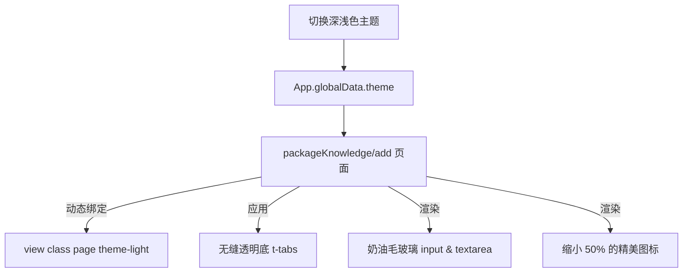

<!-- File: /Users/zhangjiahao/IdeaProjects/swarm/docs/design_records/2026-06-21_miniprogram-add-page-refactoring.md -->
# 底层设计文档 (LLD) - 微信小程序添加文档分包页面美化与深浅色模式同步重构方案

本文档旨在对微信小程序中的硬编码样式、非标设计进行全局美化。同时，将高频重复的界面元素提取为标准化的微信小程序自定义组件，依托全局“Swarm 暖绒奶油设计体系 v3 (Warm Cream UI)”构筑风格高度统一的体验。

---

## 1. 架构定位

在小程序的表示层 (`frontend/mini-program`) 中，搜索框和空状态存在多处结构与样式硬编码重复。
我们将在 `components/` 目录下抽离出两个独立的原子组件：
1. **`search-bar` (通用搜索栏组件)**
2. **`empty-state` (通用空状态组件)**

除了分包页面 `packageKnowledge/detail` 之外，`packageKnowledge/add` (添加文档页) 也存在硬编码底色、非标圆角以及主题切换缺失的现象。我们将该页面一并收归重构，以保障 Swarm 全景风格的统一呈现。

---

## 2. 核心组件与页面重构设计

### 2.1 原子组件契约 (Atomic Components)
保持之前设计的 `search-bar` 与 `empty-state` 原子组件配置。

### 2.2 知识库添加文档页 (`packageKnowledge/add`) 主题与样式重构
- **深浅色模式接入**:
  - 在 `packageKnowledge/add/index.js` 的 `data` 声明 `theme: ""`，并定义 `onShow()` 生命周期钩子从 `getApp().globalData.theme` 获取主题状态进行同步。
  - 在 `packageKnowledge/add/index.wxml` 顶层绑定 `<view class="page {{theme}}">`。
- **Tab 栏与输入控件美化**:
  - 为 `t-tabs` 增加 `custom-tabs` 样式类，去除实底，改为无缝悬浮透明底。
  - 重塑输入框 `.field-input` 和 `.url-input` 为高品质奶油毛玻璃输入框，圆角绑定全局 `var(--radius-lg)`，高度由 `72rpx` 规范化为 `88rpx`（符合大厂舒适输入高度）。
  - 在 WXSS 中覆盖 `t-textarea` 的 `--td-textarea-` 前缀变量，使其拥有契合项目的主题毛玻璃底与圆角。
- **按钮与结果卡片升级**:
  - 为 `t-button` 增加 `submit-btn` 样式类，圆角设为 `var(--radius-lg)`，高度提升为 `96rpx`，激活时赋予渐变与品牌高光影效果 (`var(--shadow-glow)`)。
  - 文档结果反馈卡 `.result-card` 的圆角重构为 `var(--radius-md)`。
- **图标尺寸折半**:
  - 页面全部图标（返回 chevron-left、反馈 result.success 状态图、返回列表 list 按钮图）尺寸一律缩小一半，分别设为 16rpx、18rpx 和 12rpx。

---

## 3. 全局页面重构控制流转

---

## 4. 防御与兜底设计

- **输入安全防溢出**: 增加 `autosize` 自定义高度配置，避免用户在手动录入大篇幅正文内容时，因内容过多超出输入域而导致文本框底端被吞掉的显示问题。
- **主题缺省拦截**: 若 `getApp()` 加载时序稍晚，JS 将在 onLoad 中初始化数据并执行静默兜底，以默认的暗色调进行页面初次绘制，避免闪退或闪白。

---

## 5. 执行拆解 (Todo List)

### 5.1 【步骤 3.1】ADR 归档
- 将本次添加文档分包页面美化的详细设计归档至 `docs/design_records/2026-06-21_miniprogram-add-page-refactoring.md`。

### 5.2 【步骤 3.2】知识库添加文档页重构 (`packageKnowledge/add`)
- 修改 `packageKnowledge/add/index.js`：
  - 初始化 `theme` 变量并在 `onShow` 里同步全局主题状态。
- 修改 `packageKnowledge/add/index.wxml`：
  - 顶层绑定 `{{theme}}`。
  - 为 `t-tabs` 增加 `custom-tabs` 类。
  - 为主提交按钮 `t-button` 增加 `submit-btn` 类。
  - 将所有的 `t-icon` 尺寸减半（返回图标改为 16，反馈图标改为 18，底部链接图标改为 12）。
- 修改 `packageKnowledge/add/index.wxss`：
  - 去除头部 `.page-header`、输入框 `.field-input`/`.url-input` 上的硬编码底色和非标圆角。
  - 重构输入框为奶油毛玻璃质感，高度升级为 88rpx。
  - 重构主提交按钮 `.submit-btn` 并覆盖 `t-textarea` 全量设计变量使其玻璃化。
  - 优化 `.result-card` 的圆角大小为 `var(--radius-md)` 并重组其状态底色。

### 5.3 【步骤 3.3】全局效果走查
- 在微信开发者工具中预览，在“知识库 -> 文档列表”中点击“添加文档”，全面测试三种录入方式下的奶油排版与主题同步。
