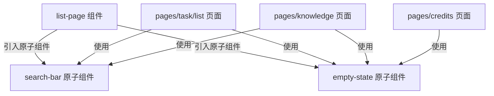

<!-- File: /Users/zhangjiahao/IdeaProjects/swarm/docs/design_records/2026-06-21_miniprogram-style-refactoring.md -->
# 底层设计文档 (LLD) - 微信小程序全案风格美化与组件抽离重构方案

本文档旨在对微信小程序中的硬编码样式、非标设计进行全局美化。同时，将高频重复的界面元素提取为标准化的微信小程序自定义组件，依托全局“Swarm 暖绒奶油设计体系 v3 (Warm Cream UI)”构筑风格高度统一的体验。

---

## 1. 架构定位

在小程序的表示层 (`frontend/mini-program`) 中，搜索框和空状态存在多处结构与样式硬编码重复。
我们将在 `components/` 目录下抽离出两个独立的原子组件：
1. **`search-bar` (通用搜索栏组件)**
2. **`empty-state` (通用空状态组件)**

通过组件封装，各页面均可通过参数控制组件行为，样式完全遵循 `app.wxss` 声明的设计 Token，彻底根除结构与样式的历史遗留债务，实现项目级高内聚低耦合。

---

## 2. 核心组件契约与设计

### 2.1 `search-bar` (通用搜索栏组件)
- **定位**: 用于统一全案的搜索框交互，内置防抖和一键清空。
- **物理路径**:
  - [NEW] `components/search-bar/search-bar.wxml`
  - [NEW] `components/search-bar/search-bar.wxss`
  - [NEW] `components/search-bar/search-bar.json`
  - [NEW] `components/search-bar/search-bar.js`
- **契约定义**:
  - `properties`:
    - `value` (`String`): 搜索关键词
    - `placeholder` (`String`): 搜索框占位符，默认 `"搜索..."`
  - `events`:
    - `change`: 输入框内容变化时触发，输出 `{ value }`
    - `confirm`: 用户点击键盘搜索时触发，输出 `{ value }`
    - `clear`: 用户清空输入框时触发

### 2.2 `empty-state` (通用空状态组件)
- **定位**: 统一全案的缺省页，支持自定义 icon 装饰与副文本说明，带有浮动呼吸微动效。
- **物理路径**:
  - [NEW] `components/empty-state/empty-state.wxml`
  - [NEW] `components/empty-state/empty-state.wxss`
  - [NEW] `components/empty-state/empty-state.json`
  - [NEW] `components/empty-state/empty-state.js`
- **契约定义**:
  - `properties`:
    - `icon` (`String`): 缺省图图标（TDesign 预设图标名，如 `"bookmark"`, `"mail"`），默认 `"info-circle"`
    - `label` (`String`): 主提示文本，默认 `"暂无数据"`
    - `desc` (`String`): 辅助副标题文本，默认 `""`
  - `slots`:
    - 允许子节点传入额外的自定义操作按钮（如“创建任务”按钮）。

---

## 3. 全局页面重构控制流转

在抽离出原子组件后，我们需要对现存的核心列表与逻辑面板进行组件替换，控制流向如下：

同时，原先手写的硬编码内联 style、魔法字号、硬编码色值完全剥离，统一通过 WXSS 类指向全局 CSS Token。

---

## 4. 防御与兜底设计

- **低配置机型毛玻璃降级兜底**: 针对部分不支持高斯模糊 `backdrop-filter` 的旧版微信客户端，组件背景在 WXSS 中配置 `rgba` 混色后备样式，确保亮暗模式下的可读对比度。
- **动态防抖限制**: `search-bar` 触发 input 事件时做轻量防抖处理，防止频繁 setData 引起的小程序渲染层卡顿。
- **组件外部样式覆盖防线 (externalClasses)**: 小程序组件默认样式隔离。为了应对特殊布局，在 `search-bar` and `empty-state` 中声明 `externalClasses: ['custom-class']`，为父页面提供有限 of 覆盖能力，而非手写内联。

---

## 5. 执行拆解 (Todo List)

### 5.1 【步骤 3.1】ADR 归档与原子组件抽离
- **创建 `search-bar` 组件**：编写 `components/search-bar/` 下的 4 个基础文件。
- **创建 `empty-state` 组件**：编写 `components/empty-state/` 下 of 4 个基础文件。
- **重构 `list-page` 组件**：将其中的搜索条和空状态替换为新抽离的 `search-bar` 与 `empty-state` 组件，去除内联样式。

### 5.2 【步骤 3.2】知识库页面美化与重构 (pages/knowledge)
- 重构 `knowledge/index.wxml`：
  - 注册并使用 `search-bar` 与 `empty-state` 组件。
  - 去除所有内联 style 属性。
- 优化 `knowledge/index.wxss`：
  - 将 `.kb-card` 的背景与阴影改为使用 `.card.card-actionable` 类以获得高质感奶油毛玻璃浮动。
  - 升级底栏弹窗 `.popup-sheet` 的样式为玻璃卡片 `.glass-sheet`。

### 5.3 【步骤 3.3】任务列表页面美化与重构 (pages/task/list)
- 重构 `task/list/index.wxml`：
  - 注册并使用 `search-bar` 与 `empty-state` 组件。
  - 剔除空状态、重新加载、列表底部加载等处的硬编码内联样式。
- 优化 `task/list/index.wxss`：
  - 重构 `.kpi-card` 状态卡样式，使其使用统一的奶油毛玻璃与圆角，激活状态时使用明显的发光高亮（`var(--shadow-glow)`）。
  - 处理列表底部的加载中指示器与“已加载全部”文本的大小与间距。

### 5.4 【步骤 3.4】个人中心页面重构 (pages/profile)
- 修改 `profile/index.wxml`：
  - 彻底清除所有菜单行（“关于”、“深色模式”等）内联的 `style="border-radius: ..."`。
  - 去除头像骨架屏、分割线间距、按钮排列的全部内联 style 属性。
- 修改 `profile/index.wxss`：
  - 将列表圆角下沉到 `:first-child`/`:last-child` 中，统一调用大奶油圆角 `var(--radius-lg)`。
  - 重构 `.edit-sheet` 编辑弹窗为统一的 `.glass-sheet` 奶油毛玻璃，并统一输入框的样式尺寸。

### 5.5 【步骤 3.5】积分可用中心美化 (pages/credits)
- 修改 `credits/index.wxml`：
  - 注册并使用 `empty-state` 组件。
  - 去除广告面板、好友分享栏等多处硬编码内联样式。
- 修改 `credits/index.wxss`：
  - 定义动作网格 `.action-grid-item` 内元素的子类规则，避免样式硬编码。
  - 修改模拟广告面板 `.ad-panel` 为标准毛玻璃奶油卡片风格。

### 5.6 【步骤 3.6】部署与协同编排页面美化 (pages/deploy)
- 修改 `deploy/index.wxml`：
  - 移除新增步骤、添加智能体选择弹框内部搜索栏的多处内联 `style`。
- 修改 `deploy/index.wxss`：
  - 优化步骤卡片 `.step-card` 的背景与阴影，将输入和选择触发器 `.step-picker-trigger` 的背景由实底改为适配奶油风的微浮雕设计。
  - 重构智能体选择弹框 `.picker-sheet` 的顶部、中部、底部配色与阴影层次，消除硬编码。

### 5.7 【步骤 3.7】全局效果走查
- 启动微信开发者工具，在多设备尺寸和亮暗模式下，全面走查并确认所有组件的奶油毛玻璃与大圆角效果是否一致，触控反馈与回弹效果是否正常。
