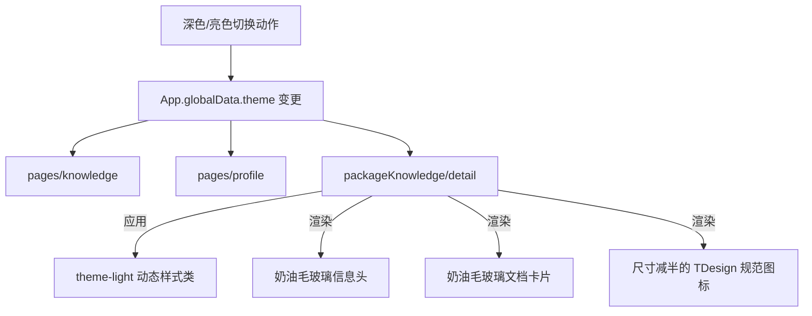

<!-- File: /Users/zhangjiahao/IdeaProjects/swarm/docs/design_records/2026-06-21_miniprogram-subpackage-refactoring.md -->
# 底层设计文档 (LLD) - 微信小程序分包页面美化与深浅色模式同步重构方案

本文档旨在对微信小程序中的硬编码样式、非标设计进行全局美化。同时，将高频重复的界面元素提取为标准化的微信小程序自定义组件，依托全局“Swarm 暖绒奶油设计体系 v3 (Warm Cream UI)”构筑风格高度统一的体验。

---

## 1. 架构定位

在小程序的表示层 (`frontend/mini-program`) 中，搜索框和空状态存在多处结构与样式硬编码重复。
我们将在 `components/` 目录下抽离出两个独立的原子组件：
1. **`search-bar` (通用搜索栏组件)**
2. **`empty-state` (通用空状态组件)**

此外，分包页面（`packageKnowledge/detail` 知识库文档列表页）目前存在明显的硬编码、风格分裂且缺失深浅色主题切换。我们将该页面一并收拢至本次重构版图，确保全案风格的绝对纯净与高度统一。

---

## 2. 核心组件与页面重构设计

### 2.1 原子组件契约 (Atomic Components)
保持之前设计的 `search-bar` 与 `empty-state` 原子组件。在 `empty-state` 中内置 `iconSize` (默认 80) 与 `iconWrapSize` (默认 140) 参数用以控制缺省图大小。

### 2.2 知识库文档列表页 (`packageKnowledge/detail`) 主题与样式重构
- **深浅色模式接入**:
  - 在 `packageKnowledge/detail/index.js` 的 `data` 声明 `theme: ""`，并在 `onShow` 和 `onLoad` 中获取 `getApp().globalData.theme`，动态装配 `.theme-light` 类。
  - 在 `packageKnowledge/detail/index.wxml` 顶层绑定 `<view class="page {{theme}}">`。
- **全案奶油 Token 重绘**:
  - 升级知识库信息头 `.kb-header` 和文档卡片 `.doc-card` 为奶油毛玻璃卡片效果，移除硬编码 shadow、圆角及 `var(--bg-surface-solid)` 实色背景。
  - 将操作栏 `.action-btn` 的圆角重构为 Token 变量 `var(--radius-md)`。
  - 将所有图标尺寸缩小一半（`size="28"` 缩减为 `size="14"`，`size="22"` 缩减为 `size="11"`），同时将不存在的图标 `file-text` 更改为 TDesign 原生支持的 `file-txt`。
  - 将手写的缺省页替换为 `<empty-state>` 组件，并传入缩小一半的尺寸。

---

## 3. 全局页面重构控制流转

---

## 4. 防御与兜底设计

- **分包独立加载容错**: 分包页面可能会在微信被直接作为分享页冷启动打开。如果全局 `theme` 尚未初始化完毕，JS 会在 onLoad 中拦截并做兜底回退，防止页面底色由于数据加载时序差出现白屏或空白。
- **缺失图标映射防错**: 微信小程序 TDesign 图标库在历史版本中命名有轻微变动。全案统一将文件图标指向 `file-txt` 并确保在组件的 JSON 中已全量声明 TDesign 依赖。

---

## 5. 执行拆解 (Todo List)

### 5.1 【步骤 3.1】ADR 归档与原子组件抽离
- 归档 ADR 文档并创建 `search-bar` 和 `empty-state` 原子组件。

### 5.2 【步骤 3.2】知识库文档列表页面重构 (`packageKnowledge/detail`)
- 修改 `packageKnowledge/detail/index.json`：
  - 注册 `empty-state` 原子组件。
- 修改 `packageKnowledge/detail/index.js`：
  - 初始化 `theme` 变量，并在 `onShow` 中实现全局深浅色主题的状态同步。
- 修改 `packageKnowledge/detail/index.wxml`：
  - 在顶层元素绑定 `{{theme}}`。
  - 替换原手写的 empty 缺省界面为 `empty-state` 组件。
  - 精确缩减页面内所有 t-icon 图标的 `size` 至原本的 50%。
  - 将无效的 `file-text` 图标更正为 `file-txt`。
- 修改 `packageKnowledge/detail/index.wxss`：
  - 将 `.kb-header` 和 `.doc-card` 的背景与阴影升级为奶油毛玻璃卡片样式。
  - 重构操作栏 `.action-btn` 的圆角为 `var(--radius-md)` 并去除多余样式。

### 5.3 【步骤 3.3】全局效果核查
- 在微信开发者工具中重新编译，核对文档详情列表页亮暗模式切换及整体风格一致性。
