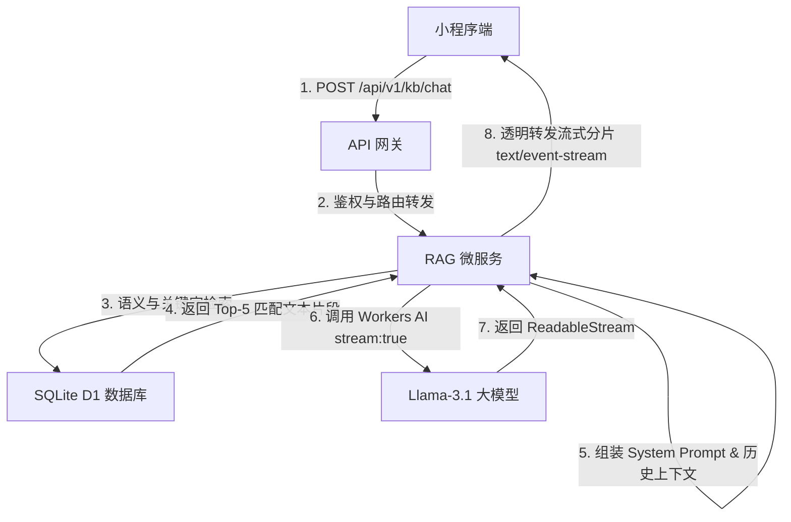

# 底层设计文档 (LLD) - 知识库 AI 流式智能问答系统设计

本方案设计了在后端（`RAG_SVC`）中新增 `/api/v1/kb/chat` 接口，结合 Cloudflare Workers AI 大模型及向量检索，向微信小程序提供真正的生成式 RAG 问答服务；并在前端（`packageKnowledge/chat`）引入分片流式请求（`enableChunked`）、打字机缓冲队列以及滚动锚定锁屏控制，以实现大厂级别的流式问答体验。

## 1. 架构定位
- **所属模块**:
  - 后端：知识库微服务 (`backend/workers/rag`) 与网关路由层。
  - 前端：微信小程序知识库对话包 (`frontend/mini-program/packageKnowledge/chat`)。
- **外部依赖**:
  - 依赖 SQLite D1 中的文档分块进行语义及关键字检索。
  - 依赖 Cloudflare Workers AI 的 `@cf/meta/llama-3.1-8b-instruct-fp8` 进行检索上下文回答。
  - 依赖微信小程序 `wx.request` 的分片（Chunked）数据监听。

---

## 2. 核心契约与接口设计 (API Contracts)

### 2.1 知识库流式问答接口
- **请求方法**: `POST`
- **请求路径**: `/api/v1/kb/chat`
- **请求头**:
  - `Content-Type: application/json`
  - `Authorization: Bearer <token>`
- **请求体**:
  ```json
  {
    "kbId": "3d611339-3d96-4bc7-b733-4cfb4b1ace44",
    "query": "如何在系统里添加智能体？",
    "history": [
      { "role": "user", "content": "你好" },
      { "role": "assistant", "content": "你好！我是知识库问答助手。" }
    ]
  }
  ```
- **响应格式**: `text/event-stream` (Server-Sent Events)
  - 每一个分片数据格式为：`data: {"response": "..."}\n\n`
  - 结束标志：`data: [DONE]\n\n`

---

## 3. 控制流转与算法设计 (Control Flow & Algorithms)



### 3.1 后端 RAG 检索与大模型提示词设计
在后端收到用户的 query 后：
1. 提取最相关的 Top-5 文档片段，拼接为 `context`。
2. 构建 System Prompt 强化大模型的事实遵从性，防止幻觉：
   ```text
   你是一个专业且耐心的知识库问答助手。
   请根据以下提供的【参考内容】回答用户提出的问题。
   如果从【参考内容】中无法找到相关答案，请直接、委婉地告诉用户“抱歉，在知识库中未找到关于该问题的相关参考内容”，绝对不能凭空编造、捏造事实或提供与参考内容冲突的回答。
   
   【参考内容】:
   {context}
   ```
3. 调用 `ai.run` 开启 `stream: true`。

### 3.2 前端 Chunked 流解析与打字机缓冲机制
1. **小程序流监听**: 
   - 使用 `wx.request`，配置 `enableChunked: true`。
   - 监听 `onChunkReceived`，将 ArrayBuffer 使用 TextDecoder 转换成 UTF-8 文本。
   - 正则表达式或按行拆分，提取 `data: {"response":"..."}` 中的 response 字符段追加进 `typewriterQueue` 队列。
2. **打字机平滑消费与滚动跟随**:
   - 启动 40ms 的定时器，根据队列积压厚度自适应平滑追加 1~4 个字符，并增量重绘 HTML。
   - 根据 `autoScroll` 状态自适应下滚或唤起新消息悬浮球，支持点击复位。

---

## 4. 防御与安全设计
1. **输入参数硬性校验**: 参数缺少 `kbId` 或 `query` 时，立即返回 400 Bad Request。
2. **知识库未找到兜底**: 若知识库被物理删除或无文档，默认给大模型传入“暂无相关参考文档”上下文，指导大模型以温和方式拒绝。
3. **未捕获错误保障**: 流式传输异常中断或报错时，前端在打字机气泡中输出友好回执，并提供重试机制。

---

## 5. 执行拆解 (Todo List)

### Phase 1: 后端流式接口开发与路由注册
- [ ] 1. 在 `backend/workers/rag/src/controllers/rag.controller.ts` 中实现 `chatKnowledge` 控制器方法。
- [ ] 2. 在 `backend/workers/rag/src/index.ts` 中注册 `POST /api/v1/kb/chat` 路由并绑定该控制器方法。
- [ ] 3. 运行 `npm run build` 对 `rag` 服务进行 TypeScript 编译静态检查，确保无语法和类型错误。
- [ ] 4. 本地部署 `swarm-rag` 接口服务。

### Phase 2: 前端小程序流式打字与交互对接
- [ ] 5. 在 `packageKnowledge/chat/index.wxml` 中重构布局，追加滚动锚定自适应高度、打字闪烁光标以及新消息悬浮球。
- [ ] 6. 在 `packageKnowledge/chat/index.wxss` 中引入对应的悬浮球定位和光标动画 CSS 样式。
- [ ] 7. 在 `packageKnowledge/chat/index.js` 中重构 `onSend` 逻辑，基于 `wx.request` `enableChunked: true` 重构分片接收，引入打字机缓冲队列平滑渲染。
- [ ] 8. 进行端到端本地测试，确保流式问答完全打通。
